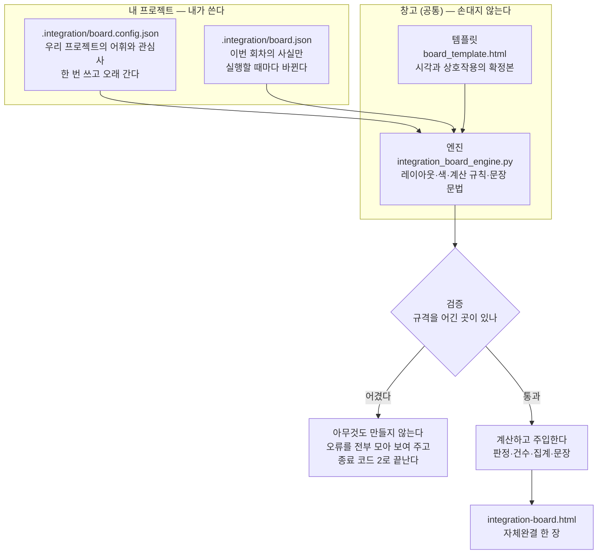
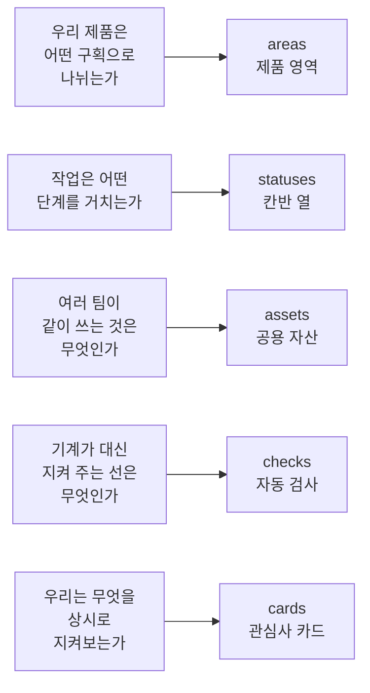
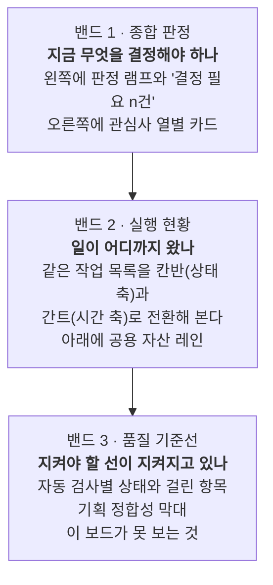

# integration-board 사용 안내서 — 처음 쓰는 사람을 위한 것

> **한 줄 요지:** 여러 팀이 각자 일할 때 **"그 일들이 아직 하나의 제품으로 맞물리고 있는가"**를 한 장으로 보여 주는 현황판이고, 쓰는 방법은 **JSON 파일 두 개를 채우고 명령 한 줄을 돌리는 것**이 전부다. 화면을 그리는 일은 창고에 고정된 엔진이 하고, 사람은 사실만 적는다.

이 문서는 이 스킬을 처음 보는 사람이 **자기 프로젝트에 보드를 띄우는 것**까지 데려가는 것을 목표로 한다. 개발 배경 지식은 필요 없고, JSON(자바스크립트 객체 표기법, 사람이 읽을 수 있는 텍스트로 데이터를 적는 형식) 파일을 열어 글자를 고칠 수 있으면 된다.

---

## 1. 이게 뭔가, 왜 있나

### 무엇을 만드는가

이 스킬은 **자체완결 HTML 한 장**을 만든다. 자체완결(self-contained)이란 그 파일 하나만 있으면 인터넷 연결이나 다른 파일 없이 브라우저에서 그대로 열린다는 뜻이다. 그래서 Jira에 붙이거나 채팅에 아티팩트로 올리면 받는 사람이 클릭 한 번으로 본다.

그 한 장이 답하는 질문은 하나다. **"여러 팀이 각자 열심히 일하고 있는데, 그 일들이 아직 하나의 제품으로 맞물리고 있는가?"** 팀별 진척률을 모아 보는 보고서가 아니라, 팀 **사이**가 어긋나고 있는지를 보는 판이다.

### 왜 사람이 매번 만들지 않고 스킬을 쓰나

이 스킬의 핵심 가치는 예쁜 화면이 아니라 **매번 판이 같다**는 것이다. 현황판을 회차마다 새로 작성하면 세 가지가 무너진다.

1. **판이 매번 달라져서 보는 사람이 매번 새로 해석해야 한다.** 지난주엔 왼쪽 위에 있던 것이 이번 주엔 아래에 있으면, 읽는 사람은 내용을 보기 전에 배치부터 다시 파악해야 한다.
2. **숫자가 손으로 옮겨 적히다가 틀린다.** "3팀이 충돌 중"이라고 사람이 세어 적으면 어느 회차에선가 반드시 틀린다.
3. **설명 자리에 그때그때의 산문이 들어가 보고서가 점점 길어진다.** 한 번 적어 두면 되는 설명을 매번 다시 쓰게 된다.

그래서 이 스킬은 **화면을 만드는 일과 사실을 채우는 일을 갈라 놓았다.** 판의 모양·색·계산 규칙·문장 문법은 창고에 고정돼 있고, 프로젝트가 하는 일은 사실을 정해진 칸에 채우는 것뿐이다. 결과적으로 두 회차의 보드를 나란히 놓으면 **자리가 같고 숫자만 다르다.** 읽는 사람은 "저 자리는 공용 자산 충돌"이라는 것을 한 번만 배우면 그다음부터는 숫자만 본다.

---

## 2. 언제 쓰고, 언제 쓰지 않나

### 이럴 때 쓴다

- 여러 팀(파트·스쿼드)이 하나의 제품을 나눠 만들고 있고, **그 사이가 벌어지는지**를 정기적으로 봐야 할 때.
- 회의에 들고 갈 **"지금 사람이 결정해야 할 것"** 목록이 필요할 때.
- 공용 자산(여러 팀이 같이 쓰는 API 규격·디자인 시스템 같은 것)을 **두 팀이 서로 다르게 고치고 있는지** 감시해야 할 때.
- 자동 검사(CI에서 도는 린트·타입체크·테스트 같은 것)의 결과를 **일정·작업과 한 화면에서** 봐야 할 때.

### 이럴 때는 쓰지 않는다

- **한 사람 또는 한 팀만의 할 일 목록**을 관리하고 싶을 때. 이 보드는 팀 사이의 맞물림을 보는 도구이므로, 팀이 하나뿐이면 대부분의 칸이 비어 의미가 없다.
- **개인 성과나 팀별 생산성**을 비교하고 싶을 때. 이 보드에는 그런 지표가 아예 없다.
- **자유롭게 쓴 서술형 보고서**가 필요할 때. 이 스킬은 산문을 적을 자리를 의도적으로 만들어 두지 않았다. 서술형 보고가 필요하면 다른 문서를 따로 쓰고 이 보드는 그 옆에 둔다.
- **디자인이 다른 대시보드**를 원할 때. 판의 모양은 확정본이라 바꿀 수 없다. 다른 모양이 필요하면 이 스킬이 아니라 다른 방법을 찾아야 한다.

---

## 3. 3겹 구조 — 이 안내서에서 가장 중요한 개념

이 스킬을 이해하는 열쇠는 **무엇을 내가 쓰고 무엇을 엔진이 계산하는가**의 경계다. 전체는 세 겹으로 나뉜다.



세 겹이 각각 무엇을 담고 누가 소유하는지는 이렇다.

| 겹 | 사는 곳 | 누가 소유 | 무엇이 들어가나 | 얼마나 자주 바뀌나 |
|---|---|---|---|---|
| **엔진** | 창고 `.claude/skills/integration-board/assets/` | 창고(모든 프로젝트가 공유) | 레이아웃, 색, 상호작용, 계산 규칙, 판정 문장 | 거의 안 바뀐다 |
| **config** | 내 프로젝트 `.integration/board.config.json` | 그 프로젝트 | 팀·제품 영역·공용 자산·자동 검사의 **이름과 설명**, 무엇을 지켜볼지(카드), 경계값 | 분기에 한 번 정도 |
| **data** | 내 프로젝트 `.integration/board.json` | 그 프로젝트, 매 실행 | 작업 목록, 상태, 날짜, 위반, 검사 실행 결과 — **사실만** | 실행할 때마다 |

### 사람이 쓰는 것과 엔진이 계산하는 것의 경계

이 경계를 헷갈리면 검증에서 막힌다. 아래가 그 선이다.

**사람이 쓰는 것**은 이름과 사실이다. 팀 이름, 제품 영역 이름, 어떤 작업이 어느 상태인지, 계획 날짜가 언제인지, 어떤 검사가 이번에 돌았는지 같은 것이다. 이것들은 사람만 알 수 있고 데이터에서 유도할 수 없다.

**엔진이 계산하는 것**은 그 사실들에서 나오는 판단과 숫자다. 종합 판정(위험·주의·정상)이 무엇인지, 결정이 필요한 건이 몇 건인지, "5팀 중 2팀이 서로 다르게 고쳤다" 같은 문장, 칸반 열별 건수, 간트의 영역 롤업, 어느 카드가 위험인지 — 전부 엔진 몫이다.

**중요한 것은 이 경계가 권고가 아니라 강제라는 점이다.** 스키마(schema, 어떤 항목을 쓸 수 있는지 정해 둔 규격)에 판정·건수·요약문을 적을 자리가 **아예 없다.** 억지로 넣으면 엔진이 "스키마에 없는 항목입니다"라며 거부하고 HTML을 만들지 않는다. 그래서 "사람은 사실만 적고 해석은 엔진이 한다"는 원칙이 매 실행 자동으로 지켜진다.

---

## 4. 5분 따라하기 — 첫 보드 띄우기

번들된 예시를 그대로 복사해 돌려 보는 것이 가장 빠르다. 예시는 **사내 웹 서비스 팀**(제품 영역이 결제·인증·검색·알림이고, 공용 자산이 API 스키마·디자인 시스템·이벤트 규격인 팀)을 가정한 것이라, 어느 도메인에서 읽어도 뜻이 통한다.

아래 명령은 실제로 돌려 확인한 것이다. `SKILL` 변수는 스킬이 놓인 경로이며, 창고에서 동기화된 저장소에서는 `.claude/skills/integration-board`다. 다른 곳에 있다면 그 경로로 바꾼다.

```bash
SKILL=.claude/skills/integration-board

# 1. 내 프로젝트에 .integration 폴더를 만들고 예시 두 개를 복사한다
mkdir -p .integration
cp $SKILL/assets/board.config.web-example.json .integration/board.config.json
cp $SKILL/assets/board.web-example.json        .integration/board.json

# 2. 엔진을 돌린다 (파이썬 표준 라이브러리만 쓰므로 따로 설치할 것이 없다)
python3 $SKILL/assets/integration_board_engine.py \
  --config .integration/board.config.json \
  --data   .integration/board.json \
  --out    integration-board.html
```

성공하면 아래처럼 출력된다. 실제 실행 결과를 그대로 옮긴 것이다(맨 앞 경로는 각자의 작업 폴더에 따라 다르다).

```
통합 현황판을 만들었습니다 → /.../integration-board.html
  판정 위험 · 결정 필요 2건 · 작업 10건(일정 미정 1) · 공용 자산 3 · 자동 검사 5(통과 3 · 미보고 0) · 76,279 bytes
```

이 한 줄이 이미 보고서다. 예시 데이터에서 엔진이 스스로 "판정은 위험이고, 사람이 결정해야 할 것이 2건"이라고 계산해 낸 것이다. 만들어진 `integration-board.html`을 브라우저로 열면 보드가 나온다.

### 엔진이 살아 있는지만 빠르게 확인하고 싶을 때

인자를 모두 생략하면 번들된 예시(하드웨어팀 쪽)로 데모가 나온다. 현재 폴더에 `integration-board.html`이 만들어진다.

```bash
python3 $SKILL/assets/integration_board_engine.py
```

실제 출력은 이렇다.

```
통합 현황판을 만들었습니다 → /.../integration-board.html
  판정 위험 · 결정 필요 2건 · 작업 12건(일정 미정 2) · 공용 자산 2 · 자동 검사 6(통과 3 · 미보고 1) · 76,073 bytes
```

---

## 5. 내 프로젝트에 맞추기 — config 채우기

예시가 돌아가는 것을 봤으면, 이제 그 안의 **이름과 설명만** 우리 프로젝트의 말로 바꾼다. 엔진은 그 프로젝트가 무엇을 만드는지 모르며, 화면에 나오는 이름은 전부 config에서 온다. **엔진 파일은 건드리지 않는다.**

### config가 답하는 다섯 가지 질문



필수 항목은 `board`(보드 이름표), `lanes`(관심사 열), `statuses`, `areas`, `cards` 다섯 개다. `assets`·`checks`·`teams`·`thresholds` 등은 선택이며, 선언하지 않으면 화면에서 그 구획이 사라진다.

### 5.1 제품 영역 (`areas`) — 제품이 어떤 구획으로 나뉘는가

작업이 속한 제품의 구획이며, 간트(시간 축 막대 차트)에서 부모 행이 된다.

```json
"areas": [
  { "key": "payment", "label": "결제", "en": "Payment" },
  { "key": "auth",    "label": "인증", "en": "Auth" }
]
```

`key`는 다른 곳에서 이 영역을 가리킬 때 쓰는 짧은 식별자이고, `label`이 화면에 나오는 이름이다. `en`은 그 옆에 작게 붙는 영문으로 생략할 수 있다.

### 5.2 칸반 열 (`statuses`) — 작업이 거치는 단계

```json
"statuses": [
  { "key": "review", "label": "검토대기", "tone": "amber",
    "mean": "반영 요청(PR)이 열려 사람의 승인을 기다리는 중" }
]
```

`tone`은 색인데, **정해진 이름 중에서만** 고른다. 쓸 수 있는 값은 `red`, `amber`, `green`, `blue`, `teal`, `dim`, `muted`, `neutral` 여덟 개다. `#ff00ff` 같은 색상 코드를 직접 쓰면 거부된다. 프로젝트마다 새 색이 생겨 판이 달라지는 것을 막기 위한 장치다.

`mean`은 열 아래 한 줄로 붙는 "이 상태가 무슨 뜻인가" 설명이다.

### 5.3 공용 자산 (`assets`) — 여러 팀이 같이 쓰는 것

여러 팀이 함께 의존하는 것을 적는다. 사내 웹 서비스 예시에서는 API 스키마·디자인 시스템·이벤트 규격이고, 하드웨어팀 예시에서는 디자인 토큰·공용 데이터 계약이다.

```json
"assets": [
  { "key": "apischema", "label": "API 스키마",
    "plain": "여러 클라이언트가 함께 의존하는 요청·응답의 모양",
    "why": "두 팀이 각자 바꾸면 남의 화면이 조용히 깨진다" }
]
```

### 5.4 자동 검사 (`checks`) — 기계가 대신 지켜 주는 선

```json
"checks": [
  { "key": "secscan", "name": "야간 보안 검사",
    "plain": "의존성 목록을 알려진 취약점 데이터베이스와 매일 대조한다",
    "why": "아무도 큐를 보지 않아 알려진 취약점이 그대로 배포된다" }
]
```

**여기에 통과 여부를 쓰지 않는다.** 검사가 이번에 통과했는지는 config가 아니라 data에서 온다(6절 참고). config에는 "이런 검사가 있다"는 사실과 설명만 적는다.

### 5.5 관심사 카드 (`cards`) — 우리는 무엇을 상시로 지켜보는가

config에서 가장 중요한 절이다. 카드는 "이 프로젝트가 늘 걱정하는 것"의 목록이고, 밴드 1(맨 위 종합 판정 구역)에 한 장씩 놓인다.

```json
{ "key": "ov-api", "lane": "cohesion", "title": "API 스키마",
  "plain": "여러 클라이언트가 함께 의존하는 요청·응답의 모양",
  "why": "두 방향으로 동시에 바뀌면 남의 화면이 조용히 깨진다",
  "metric": { "kind": "asset", "asset": "apischema" },
  "decide": true,
  "traceChecks": ["apidiff"] }
```

- `lane`은 이 카드를 어느 관심사 열에 놓을지다. `lanes`에 선언한 key여야 한다.
- `metric`은 **무엇을 세어 이 카드의 문장을 만들지**다. 종류는 여덟 가지이며 아래 표에 있다.
- `decide`를 `true`로 두면 "사람이 답해 주기 전에는 진행할 수 없는 것"이라는 뜻이다. 다만 배지는 그 카드가 **실제로 위험·주의일 때만** 붙는다. 늘 붙어 있으면 신호가 죽기 때문이다.
- `traceChecks`는 카드를 눌렀을 때 함께 밝힐 자동 검사다. 작업이나 공용 자산 쪽 연결은 지표에서 자동으로 나오므로 적을 필요가 없다.

**지표(metric.kind)를 고르는 법** — "무엇이 걱정인가"에서 출발한다.

| 걱정 | 고를 지표 | 엔진이 만드는 문장(예) |
|---|---|---|
| 여러 팀이 같은 것을 서로 다르게 고치고 있는가 | `asset` | "5팀 중 **2팀**이 서로 다르게 고쳤다" |
| 지켜야 할 선이 실제로 지켜지는가 | `check` | "위반 후보 **1건** · 자동 검사 5개 중 **3개** 통과" |
| 어느 영역이 막혀 뒤가 밀리는가 | `area_stalled` | "검토대기가 **12일**째 움직이지 않는다" |
| 어느 영역이 계획보다 늦는가 | `area_delay` | "**1건**이 계획보다 **7일** 늦다" |
| 언제 끝날지 모르는 일이 남아 있는가 | `undated` | "**1건**이 아직 시간 축에 올라가지 못했다" |
| 최근에 무엇이 실제로 나갔는가 | `status_recent` | "최근 14일 배포완료 **1건**" |
| 만들다 보니 기획과 벌어진 곳이 쌓이는가 | `drift` | "기획 이탈 **3건** 누적 · 기획 전환 후보 **1건**" |
| 위 어디에도 안 맞는 걱정거리인가 | `count` | "해당 작업 **2건**" |

`count`는 나머지 일곱 개로 표현할 수 없는 걱정거리를 위한 탈출구다. **숫자를 손으로 적는 것이 아니라 조건을 선언하면 엔진이 센다.**

```json
{ "kind": "count", "match": { "block": "waiting" }, "warnAt": 1, "riskAt": 4 }
```

이것은 "다른 팀의 답을 기다리느라 막혀 있는 작업"을 세고, 1건부터 주의, 4건부터 위험으로 보라는 선언이다. `match`에 쓸 수 있는 항목은 작업이 실제로 가진 것뿐이다(`area`, `status`, `team`, `block`, `touches`, `drift`). 여러 개를 적으면 **모두** 만족하는 작업만 센다.

### 5.6 `{뜻}`과 `{걸리면}`을 왜 적어야 하나 — 이 스킬의 작은 규율

공용 자산·자동 검사·관심사 카드에는 모두 `plain`(뜻)과 `why`(걸리면)라는 두 문장을 붙일 수 있다. 화면에는 각각 **"뜻"**과 **"걸리면"**이라는 라벨을 달고 그대로 나온다.

- `plain` = **이게 무엇인가.** 그 이름을 처음 보는 사람에게 한 줄로 설명한다.
- `why` = **어긋나면 무슨 일이 생기나.** 왜 이것을 지켜봐야 하는지의 이유다.

이 두 줄을 적으라는 이유는 하나다. **보드를 보는 사람은 대개 그 팀 내부 사람이 아니다.** 경영진, 다른 팀 리드, 새로 합류한 사람이 이 판을 연다. 그들에게 "이벤트 규격 — 3팀 중 1팀 대기"만 보여 주면 아무 판단도 할 수 없다. "이벤트 규격이란 사용자 행동 로그의 이름과 항목 약속이고, 이름이 바뀌면 그 위에 세운 지표가 전부 틀어진다"까지 함께 보여야 비로소 그 숫자가 심각한지 아닌지를 판단할 수 있다.

그리고 이 문장은 **config에 한 번만 적고 계속 재사용된다.** 매 회차 다시 쓰지 않는다. 이것이 "보고서가 회차마다 길어지는 문제"를 막는 방식이다.

### 5.7 팀 명부 (`teams`)와 경계값 (`thresholds`)

`teams`는 선택이지만, 적으면 공용 자산 카드의 **"n팀 중 m팀"에서 n이 무엇인지**가 달라진다.

- **명부를 선언하면** n은 그 명부의 크기, 즉 **전체 팀 수**다. 대신 모든 작업의 `team`이 명부 안에 있어야 하며, 없으면 거부된다(그러지 않으면 표시가 거짓말이 되기 때문이다).
- **선언하지 않으면** n은 **그 자산을 실제로 건드린 팀 수**다.

`thresholds`는 위험 신호가 켜지는 경계값이며, 네 개만 열려 있다.

| 항목 | 뜻 | 기본값 |
|---|---|---|
| `stallRiskDays` | 며칠 이상 멈춰 있으면 '위험'인가 (1일 이상은 '주의') | 14 |
| `delayRiskDays` | 계획보다 며칠 이상 늦으면 '위험'인가 (1일 이상은 '주의') | 30 |
| `recentDays` | `status_recent` 지표가 보는 "최근"이 며칠인가 | 7 |
| `laneMaxCards` | 관심사 열에 처음부터 펼쳐 두는 카드 수 | 3 |

프로젝트마다 리듬이 다르기 때문에 이 네 개만 열어 두었다. 2주 스프린트로 도는 팀에게 "30일 늦으면 위험"은 신호가 너무 늦게 켜지고, 리드타임이 반년인 프로젝트에는 너무 민감하다. 참고로 번들된 웹 서비스 예시는 `{ "stallRiskDays": 10, "delayRiskDays": 21, "recentDays": 14, "laneMaxCards": 3 }`으로 조여 놓았다.

---

## 6. 매 회차 data 채우기 — 사람은 사실만, 해석은 엔진이

config를 한 번 정해 두면, 그다음부터 회차마다 하는 일은 `.integration/board.json`을 갱신하는 것뿐이다.

### 6.1 무엇을 적나

data의 최상위에 쓸 수 있는 항목은 아래가 전부다.

```
필수:  today · works
선택:  updated · target · violations · checkRuns · drift
```

`today`는 오늘선이 서는 자리이자 시간 축의 기준일이다. `target`은 목표일 파선, `updated`는 갱신 시각이다.

### 6.2 작업 목록 (`works`)

```json
{ "id": "PR-812", "title": "결제 응답 구조 분리",
  "area": "payment", "team": "결제팀", "status": "review",
  "block": "conflict", "touches": ["apischema", "eventspec"],
  "planStart": "2026-07-14", "planEnd": "2026-07-28",
  "progress": 85, "eta": "2026-08-14" }
```

| 항목 | 필수 | 뜻과 규칙 |
|---|---|---|
| `id` | 필수 | 작업의 고유 식별자. 중복되면 거부된다. |
| `title` | 필수 | 작업 이름. 화면에 그대로 나오는 **유일한 자유 문자열**이다(설명이 아니라 이름이므로 허용된다). |
| `area` | 필수 | config의 `areas`에 있는 key여야 한다. |
| `team` | 필수 | 팀 이름. `config.teams` 명부를 선언했다면 그 안에 있어야 한다. |
| `status` | 필수 | config의 `statuses`에 있는 key여야 한다. |
| `block` | 선택 | `conflict`(충돌) 또는 `waiting`(대기)만 쓸 수 있다. 막힘은 상태가 아니라 사정이므로, 칸반 열이 아니라 표식으로 붙는다. |
| `touches` | 선택 | 이 작업이 건드리는 공용 자산. 여러 개면 배열, 하나면 문자열 하나로도 쓸 수 있다. |
| `planStart`·`planEnd` | 선택 | 계획 구간. **둘은 함께 있거나 함께 없어야 한다.** 없으면 "일정 미정" 그룹으로 간다. |
| `progress` | 선택 | 0~100 정수. 없으면 0으로 본다. |
| `eta` | 선택 | 예상 종료일. `planEnd`가 있어야 쓸 수 있다. `planEnd`를 넘기면 간트에 지연 빗금이 그려진다. |
| `completedAt` | 선택 | 실제로 끝난 날. `status_recent` 지표가 이 값을 먼저 보고, 없을 때만 `planEnd`로 물러난다. |
| `deps` | 선택 | 선행 작업 id 목록. 없는 id나 자기 자신을 넣으면 거부된다. |
| `stalledDays` | 선택 | 며칠째 움직이지 않았는가. `area_stalled` 지표가 쓴다. |
| `drift` | 선택 | 기획과 어긋난 작업인지 여부. |

### 6.3 검사 결과 두 가지 — `violations`와 `checkRuns`

`violations`는 **검사에 걸린 것**을 적는다.

```json
"violations": [
  { "check": "secscan", "severity": "block" },
  { "check": "apidiff", "ref": "PR-812", "severity": "warn" }
]
```

`ref`(걸린 작업의 id)는 선택이다. 야간 보안 검사처럼 특정 작업이 아니라 저장소 전체에 걸리는 위반이 실제로는 더 흔하므로, 가리킬 작업이 없으면 비워 둔다. 그러면 화면에 "특정 작업 지정 없음"이 뜬다. `severity`는 `block`(막힘) 또는 `warn`(주의) 둘 중 하나다.

**위반을 설명하는 문장은 적지 않는다.** 화면에는 참조된 작업의 제목이 그대로 나온다.

`checkRuns`는 **이번 회차에 그 검사가 실제로 돌았는지**를 적는다. 문법상 선택이지만 **거의 항상 적어야 한다.**

```json
"checkRuns": { "lint": "pass", "types": "pass", "apidiff": "fail",
               "integration": "pass", "secscan": "fail" }
```

| 값 | 뜻 | 화면 |
|---|---|---|
| `pass` | 돌았고 아무 것도 걸리지 않았다 | 초록 "통과" |
| `fail` | 돌았고 걸린 것이 있다 | 위반의 무게에 따라 빨강 "위반" 또는 주황 "주의" |
| `skipped` | 이번 회차에는 건너뛰었다 | 회색 "건너뜀" |
| `never` | 아직 한 번도 돌린 적이 없다 | 회색 "실행된 적 없음" |
| (적지 않음) | 보고가 없다 | 회색 "정보 없음" |

**보고하지 않은 검사가 초록불이 되는 일은 없다.** 위반이 하나도 없다는 사실만으로 통과를 그리면, 검사를 아직 붙이지 않은 새 프로젝트가 "전부 통과"로 보인다. 사실이 아닌 초록불은 보드가 아예 없는 것보다 나쁘다. 실제로 확인해 보면, 웹 예시에서 `checkRuns`를 통째로 지우고 돌렸을 때 요약이 이렇게 바뀐다.

```
자동 검사 5(통과 3 · 미보고 0)      ← checkRuns를 적었을 때
자동 검사 5(통과 0 · 미보고 3)      ← checkRuns를 지웠을 때
```

통과가 3에서 0으로 떨어졌다. 위반이 올라온 검사 두 개만 상태가 정해지고, 나머지 세 개는 "정보 없음"으로 남은 것이다.

### 6.4 이 절의 핵심 — 판정·건수·요약문을 사람이 적으면 엔진이 거부한다

**data에는 자유 서술 필드가 하나도 없다.** "전반적으로 순조롭습니다" 같은 요약문, "판정: 정상" 같은 결론, "충돌 3건" 같은 집계 숫자를 적을 자리가 스키마에 아예 만들어져 있지 않다. 넣으려고 하면 이렇게 막힌다(실제 실행 결과다).

```
통합 현황판 엔진 — 검증 실패 2건. 아무 것도 렌더하지 않았습니다.
  1. data.summary: 스키마에 없는 항목입니다
       └ 쓸 수 있는 항목: checkRuns, drift, target, today, updated, violations, works
  2. data.verdict: 스키마에 없는 항목입니다
       └ 쓸 수 있는 항목: checkRuns, drift, target, today, updated, violations, works
```

이것은 불편하게 만들려는 제약이 아니라 **설계 사상**이다. 사람이 해석까지 적을 수 있으면 두 가지가 반드시 일어난다. 첫째, 같은 데이터가 회차마다 다른 말로 요약되어 비교가 불가능해진다. 둘째, 데이터와 요약문이 어긋나도 아무도 모른다. 그래서 이 스킬은 역할을 이렇게 나눈다.

> **사람은 사실만 적는다. 해석은 엔진이 한다.**

사람이 적는 것은 "PR-812는 검토대기이고 API 스키마를 건드리며 충돌 상태다" 같은, 확인 가능한 사실이다. 거기서 "5팀 중 2팀이 서로 다르게 고쳤으니 이 카드는 위험이고, 따라서 종합 판정은 위험"이라는 결론을 내는 것은 엔진의 일이다.

---

## 7. 보드 읽는 법

보드는 위에서 아래로 세 개의 밴드(가로 띠)로 나뉜다. 각 밴드는 서로 다른 질문에 답한다.



### 7.1 밴드 1 — 종합 판정

왼쪽에 판정 램프가 서고, 그 값은 엔진이 다음 순서로 정한다.

1. 카드 중 하나라도 **위험**이거나, 자동 검사 중 하나라도 **막힘(block) 위반**이 있으면 → **위험**.
2. 그렇지 않고 카드 중 **주의**가 있으면 → **주의**.
3. 둘 다 없으면 → **정상**.

실행 결과가 보고되지 않은 검사가 있으면, 판정 상자 아래에 **"자동 검사 n개는 실행 결과가 보고되지 않았다 — 그만큼 이 판정은 덜 안다"**가 함께 뜬다. 초록 램프가 "다 확인했다"로 읽히지 않게 하려는 장치다.

오른쪽에는 관심사 열별로 카드가 놓인다. 카드에는 엔진이 계산한 문장 한 줄과, config에 적어 둔 "뜻"·"걸리면" 두 줄이 붙는다. 한 열에 카드가 많으면 급한 순(위험 → 주의 → 정상 → 참고)으로 앞의 몇 장만 펼치고 나머지는 **"그 외 n건 펼치기"** 버튼으로 접힌다. 그 버튼을 누르면 그 자리에서 열리므로, 세어 놓고 도달할 수 없는 카드는 없다.

### 7.2 밴드 2 — 실행 현황

같은 작업 목록을 두 축으로 본다. **칸반**은 상태 축(어느 단계에 몇 건이 있나)이고, **간트**는 시간 축(언제 시작해 언제 끝나나)이다. 위쪽 전환 버튼으로 오간다.

간트에서는 제품 영역 행을 누르면 그 안의 작업이 펼쳐진다. 그려지는 것은 계획 막대, 진척률 채움, 지연 빗금(예상 종료가 계획을 넘겼을 때), 의존선(앞 작업이 끝나야 시작하는 관계), 오늘선, 목표일선이다.

계획 날짜가 없는 작업은 영역 아래가 아니라 **"일정 미정"** 그룹으로 따로 모인다. 양쪽에 두면 같은 작업을 두 번 세게 되기 때문이다. 시간 축 범위 밖의 계획(예: 84일 축에 내년 일정)은 거부되지 않고, 축 양끝에 **"축 이전 n건"·"축 이후 n건"** 표식으로 알린다.

아래에는 공용 자산 레인이 붙어, 자산마다 몇 팀이 건드렸고 그중 몇 팀이 충돌인지를 보여 준다.

### 7.3 밴드 3 — 품질 기준선

자동 검사마다 상태가 표시된다. 초록 "통과", 주황 "주의", 빨강 "위반", 그리고 회색 "건너뜀"·"실행된 적 없음"·"정보 없음"이다. 그 아래에 실제로 걸린 항목이 나열되고, 기획 정합성 막대와 **"이 보드가 못 보는 것"** 한 문단이 이어진다.

마지막 문단은 config의 `honesty`에 적는 한계 고백이다. 웹 서비스 예시에서는 이렇게 적혀 있다. "이 보드는 조각이 서로 맞물리는지는 보지만, 그 조각이 옳은 조각인지·모여서 하나의 서비스처럼 느껴지는지는 사람이 판단한다. 초록불이 곧 '좋은 서비스'를 뜻하지는 않는다."

### 7.4 색이 뜻하는 것

색은 의미색이라 엔진이 고정한다. 프로젝트가 바꿀 수 없다.

| 색 | 뜻 |
|---|---|
| 빨강 | 위험. 충돌이 있거나 막힘(block) 위반이 걸렸다. |
| 주황 | 주의. 대기 중이거나 경계값을 넘기 시작했다. |
| 초록 | 정상. 확인했고 이상이 없다. |
| 회색 | 참고 또는 정보 없음. 좋은 소식이거나, 아직 아무 보고가 없다는 뜻이다. |

**회색과 초록을 구별하는 것이 이 보드를 읽는 핵심 기술이다.** 초록은 "돌려 봤고 괜찮았다"이고, 회색은 "아직 모른다"이다. 회색이 많은 보드는 나쁜 보드가 아니라 **정직한 보드**다.

### 7.5 연결 보기 — 카드를 눌러 얽힌 것만 남기기

밴드 1의 카드를 누르면 **그 카드와 얽힌 작업·공용 자산·자동 검사만 100%로 남고 나머지는 흐려지며**, 세 밴드를 가로지르는 연결선이 그려진다. "이 걱정거리가 실제로 어떤 작업들 때문에 생겼나"를 클릭 한 번으로 추적하는 기능이다.

사용 규칙은 간단하다.

1. 한 번에 하나만 켜진다. 다른 카드를 누르면 그쪽으로 옮겨 간다.
2. 끄려면 같은 카드를 다시 누르거나, 여백을 클릭하거나, `Esc` 키를 누른다.
3. 대상이 간트의 접힌 영역 안에 있으면 그 영역이 **자동으로 펼쳐진다.**

### 7.6 특정 화면을 그대로 다시 여는 법

URL 뒤에 붙이는 질의 문자열(query string)로 화면 상태를 고정할 수 있다. 스크린샷을 찍거나 특정 상태를 공유할 때 쓴다.

| 붙이는 것 | 효과 |
|---|---|
| `?theme=light` 또는 `?theme=gc` | 밝은 테마 또는 Ground Control 다크 테마로 연다(기본은 밝은 테마다) |
| `?view=kanban` 또는 `?view=gantt` | 밴드 2를 칸반 또는 간트로 연다 |
| `?trace=<카드 key>` | 그 카드의 연결 보기를 켠 채로 연다 |

예를 들어 `integration-board.html?theme=gc&view=gantt&trace=ov-api`로 열면, 다크 테마의 간트 화면에서 API 스키마 카드의 연결 보기가 켜진 상태로 시작한다.

---

## 8. 흔한 실수와 해결

엔진은 오류를 하나 만나고 멈추지 않는다. **찾을 수 있는 것을 전부 모아 한 번에 보여 준 뒤 종료 코드 2로 끝나고, HTML은 만들지 않는다.** 조용히 넘어가는 일이 없으므로, 실행이 성공했다면 그 안의 참조는 전부 성립한다는 뜻이다.

아래는 모두 **실제로 돌려서 나온 메시지 그대로**다.

### 실수 1 — 작업에 설명이나 코멘트를 붙이려 했다

```
  1. data.works[0].comment: 스키마에 없는 항목입니다
       └ 쓸 수 있는 항목: area, block, completedAt, deps, drift, eta, id,
         planEnd, planStart, progress, stalledDays, status, team, title, touches
```

**무슨 뜻인가.** 작업 하나에 `comment` 같은 항목을 추가했는데, 스키마에 그런 자리가 없다.

**어떻게 고치나.** 그 필드를 지운다. 작업에 대해 화면에 나오는 자유 문자열은 `title` 하나뿐이다. 설명을 남기고 싶으면 그것이 **매 회차 바뀌는 사실**인지 **한 번 적어 두면 되는 설명**인지 구분한다. 후자라면 config의 `plain`·`why`에 적는다. 전자라면 애초에 보드에 들어갈 내용이 아니다.

### 실수 2 — 요약문이나 판정을 직접 적으려 했다

```
  1. data.summary: 스키마에 없는 항목입니다
       └ 쓸 수 있는 항목: checkRuns, drift, target, today, updated, violations, works
  2. data.verdict: 스키마에 없는 항목입니다
```

**무슨 뜻인가.** data 최상위에 요약문(`summary`)과 판정(`verdict`)을 넣으려 했다.

**어떻게 고치나.** 둘 다 지운다. 판정은 엔진이 카드 심각도와 위반에서 계산한다(7.1의 세 단계 규칙). 요약이 필요하면 엔진 실행 후 출력되는 한 줄(`판정 위험 · 결정 필요 2건 · …`)을 그대로 쓴다.

### 실수 3 — key에 오타가 났다

```
  1. data.works[PR-812].touches[1]: 공용 자산 'eventspecs'를 찾을 수 없습니다
       └ 선언된 값: apischema, designsys, eventspec
```

**무슨 뜻인가.** 작업 PR-812가 `eventspecs`라는 자산을 건드린다고 적었는데, config에 선언된 이름은 `eventspec`(끝에 s가 없다)이다.

**어떻게 고치나.** 메시지가 "선언된 값"을 함께 알려 주므로 그중에서 맞는 것을 고른다. 같은 방식으로 상태와 영역도 확인된다.

```
  1. data.works[PR-812].status: 상태 'merged'를 찾을 수 없습니다
       └ 선언된 값: doing, done, review, shipped
  2. data.works[PR-815].area: 제품 영역 'billing'를 찾을 수 없습니다
       └ 선언된 값: auth, notify, payment, search
```

### 실수 4 — 계획 날짜를 한쪽만 적었다

```
  1. data.works[PR-812]: planStart와 planEnd는 함께 있거나 함께 없어야 합니다
       └ 한쪽만 있으면 시간 축에 그릴 수 없습니다
  2. data.works[PR-812].eta: eta(예상 종료)는 planEnd가 있는 작업에만 쓸 수 있습니다
```

**무슨 뜻인가.** 시작일만 적고 종료일을 비웠다. 간트 막대는 시작과 끝이 모두 있어야 그릴 수 있다.

**어떻게 고치나.** 종료일을 채우거나, 아직 모른다면 **시작일도 함께 지운다.** 지우면 그 작업은 "일정 미정" 그룹으로 가서 정직하게 표시된다. 여기서 보듯 오류가 연쇄로 나기도 한다 — `eta`(예상 종료)는 `planEnd`가 있어야 쓸 수 있으므로 함께 걸렸다.

### 실수 5 — 통과라고 보고했는데 위반이 올라와 있다

```
  1. data.checkRuns.apidiff: 실행 결과를 'pass'로 보고했는데 이 검사의 위반이 1건 있습니다
       └ 통과인지 실패인지 하나로 맞추세요
```

**무슨 뜻인가.** `checkRuns`에는 API 호환성 검사가 통과했다고 적었는데, `violations`에는 같은 검사에 걸린 항목이 올라와 있다. 둘 중 하나는 틀린 말이다.

**어떻게 고치나.** 실제로 걸린 것이 있으면 `pass`를 `fail`로 바꾸고, 이미 해결된 것이면 `violations`에서 그 항목을 지운다.

참고로 `skipped`·`never`라고 적었는데 위반이 올라와 있으면 거부되지 않는다. 그 경우 엔진은 **위반 쪽을 따른다.** 올라온 사실이 보고보다 강하다고 보기 때문이다.

### 실수 6 — 팀 명부에 없는 팀 이름을 썼다

```
  1. data.works[PR-812].team: config.teams 명부에 없는 팀입니다: '신규팀'
       └ 명부를 선언했으면 모든 작업의 팀이 그 안에 있어야 「n팀 중 m팀」 표시가 정직해집니다
```

**어떻게 고치나.** 새 팀이 실제로 생겼다면 config의 `teams`에 추가한다. 오타라면 이름을 고친다.

### 실수 7 — 갱신 시각에 자유 서술을 넣었다

```
  1. data.updated: YYYY-MM-DD 또는 YYYY-MM-DD HH:MM 형식이어야 합니다: '이번 주 회의 직전 기준'
```

**무슨 뜻인가.** `updated`는 날짜·시각 전용 칸이다. "이번 주 회의 직전 기준" 같은 설명이 여기로 새어 들어오지 못하게 막혀 있다.

**어떻게 고치나.** `"2026-07-27 09:15"` 처럼 적는다.

### 그 밖에 검증이 막는 것

위 일곱 가지 말고도 다음이 막힌다. 메시지는 언제나 **"어디가(경로) · 무엇이 틀렸고 · 무엇을 쓸 수 있는지"**를 함께 알려 준다.

- 필수 항목 누락, 작업 id 중복, 자기 자신을 선행 작업으로 지정.
- 알 수 없는 값 — 막힘 사유, 위반 무게, 지표 종류, 색 이름, 문구 키, 검사 실행 결과.
- 날짜 문제 — 형식 오류, 달력에 없는 날짜(`2026-02-31`), 종료일이 시작일보다 빠른 경우.
- 범위 문제 — 진척률이 0~100 밖, 눈금 간격이 축 길이보다 큼, 경계값이 0 이하.
- 짝이 안 맞는 선언 — `drift` 카드가 있는데 데이터가 없거나 그 반대.
- 타입 오류 — 배열 자리에 객체를 넣는 등. 파이썬 예외로 죽지 않고 검증 오류로 나온다.

---

## 9. 바꿀 수 있는 것과 바꿀 수 없는 것

"이건 왜 안 바뀌지?"로 헤매지 않도록 경계를 미리 정리한다. 자세한 목록은 스키마 정본의 **"config로 바꿀 수 없는 것"** 절에 있다(그 문서에서 절 번호가 앞의 `bands` 절과 겹쳐 있으므로 번호가 아니라 제목으로 찾는다).

### 바꿀 수 있는 것

- **이름** — 보드 제목, 제품 영역·상태·공용 자산·자동 검사·관심사 열·카드의 이름.
- **설명** — 각 항목의 "뜻"(`plain`)과 "걸리면"(`why`), 한계 고백(`honesty`), 기획 정합성 라벨.
- **무엇을 지켜볼지** — 카드를 몇 장 두고 각각 어떤 지표로 셀지.
- **경계값** — `thresholds`의 네 숫자(멈춤 위험 일수, 지연 위험 일수, "최근"의 정의, 열당 펼칠 카드 수).
- **시간 축의 기하** — `axis`의 시작 여유일·전체 길이·눈금 간격.
- **고정 라벨** — 버튼과 안내문 같은 화면 문구(`text`). 다만 목록에 있는 키만 되고, 없는 키를 쓰면 거부된다.
- **격자의 열 개수** — 관심사 열·칸반 상태·검사·자산을 몇 개 선언하든 그 수에 맞춰 나뉜다. 한 줄에 다 넣기에 너무 많으면 줄을 고르게 나눈다(검사가 8개면 4개씩 두 줄).

### 바꿀 수 없는 것

1. **도출 문장.** "5팀 중 **2팀**이 서로 다르게 고쳤다", "**1건**이 계획보다 **7일** 늦다" 같은 계산 문장은 엔진 안에 고정돼 있다. 문장을 프로젝트마다 바꿀 수 있게 열어 두면 **같은 숫자가 프로젝트마다 다른 뜻으로 읽히기** 때문이다. 그 문장 안에 들어가는 **이름**만 config에서 온다.
2. **숫자 강조 색.** 위험은 빨강, 주의는 주황, 정상은 초록, 참고는 회색으로 고정이다.
3. **판정 규칙과 심각도 계산의 골격.** 무엇을 위험으로 볼지의 뼈대는 엔진이 정한다. 프로젝트가 조절할 수 있는 것은 경계값 숫자뿐이다.
4. **레이아웃·색 팔레트·상호작용.** 세 밴드의 구조, 칸반과 간트의 전환, 연결 보기, 테마 토글은 확정본이다.
5. **밴드의 개수와 순서.** `bands`로 이름은 바꿔도 세 밴드를 넷으로 늘리거나 순서를 바꿀 수는 없다.

한 줄로 요약하면 이렇다. **바꿀 수 있는 것은 이름·설명·경계값·무엇을 지켜볼지이고, 판정의 문법과 판의 모양은 창고가 갖는다.** 이것이 "매번 같은 판"이 성립하는 이유다.

---

## 10. 자주 묻는 것

**Q. 우리 팀이 3개뿐인데 써도 되나?**
된다. 팀 수에 하한이 없다. `config.teams` 명부 자체가 선택 항목이고, 필수인 것은 관심사 열·칸반 상태·제품 영역·카드가 각각 최소 1개, 작업이 최소 1건이라는 것뿐이다. 다만 팀이 하나뿐이라면 "팀 사이가 벌어지는가"라는 이 보드의 질문 자체가 성립하지 않으므로, 그때는 다른 도구를 쓰는 편이 낫다.

**Q. CI(자동으로 코드를 검사·빌드하는 시스템)를 아직 붙이지 못했다. 그래도 되나?**
된다. `checkRuns`를 비워 두면 그 검사들은 회색 **"정보 없음"**으로 남는다. **거짓 초록불은 절대 나지 않는다.** 검사를 붙이지 않은 것은 사실이고, 보드는 그 사실을 그대로 보여 준다. 검사를 아예 선언하지 않아도 되지만(`checks`는 선택 항목이다), 선언해 두고 회색으로 남기는 편이 "우리가 아직 이걸 못 보고 있다"는 것을 드러내므로 대개 더 낫다.

**Q. 어떤 작업은 아직 일정이 안 잡혔다. 날짜를 대충 넣어야 하나?**
넣지 않는다. `planStart`와 `planEnd`를 둘 다 비우면 그 작업은 간트의 **"일정 미정" 그룹**으로 따로 모인다. 그리고 `undated` 지표를 쓰는 카드를 하나 두면, 밴드 1에 "**n건**이 아직 시간 축에 올라가지 못했다"가 뜬다. 모르는 것을 모른다고 표시하는 쪽이 가짜 날짜보다 낫다는 것이 이 스킬의 태도다.

**Q. 우리는 2주 스프린트로 도는데 기본 경계값이 너무 느슨하다.**
`config.thresholds`의 네 숫자를 줄인다. 예를 들어 아래처럼 하면 "3일 멈추면 위험, 계획보다 7일 늦으면 위험, 최근은 14일"로 조여진다.

```json
"thresholds": { "stallRiskDays": 3, "delayRiskDays": 7, "recentDays": 14, "laneMaxCards": 3 }
```

경계값을 적지 않으면 기본값(멈춤 14일, 지연 30일, 최근 7일, 열당 3장)이 쓰인다.

**Q. 우리 도메인은 소프트웨어가 아닌데 쓸 수 있나?**
쓸 수 있다. 엔진은 그 프로젝트가 무엇을 만드는지 전혀 모르고, 화면에 나오는 모든 이름은 config에서 온다. 실제로 번들된 예시 두 개가 같은 스키마를 서로 다른 도메인으로 채운 것이다.

| | 사내 웹 서비스 예시 | 하드웨어팀 예시 |
|---|---|---|
| 파일 | `assets/board.config.web-example.json` | `assets/board.config.example.json` |
| 제품 영역 | 결제 · 인증 · 검색 · 알림 | 부품 · 설계변경 · 품질 · 프로젝트 · 홈 · 자재명세 |
| 공용 자산 | API 스키마 · 디자인 시스템 · 이벤트 규격 | 디자인 토큰 · 공용 데이터 계약 |
| 자동 검사 | 린트 · 타입체크 · API 호환성 · 통합 테스트 · 야간 보안 검사 | 디자인 토큰 린트 · 아키텍처 의존성 · 공용 자산 선언 정합 · 개정 통제 원칙 · 문서 매트릭스 · 사용자 흐름 검사 |

자기 도메인에 가까운 쪽을 복사해 이름만 바꾸면 된다.

**Q. 내 config가 제대로 됐는지 어떻게 확인하나?**
엔진을 한 번 돌려 보는 것이 곧 확인이다. 검증을 통과했다면 모든 참조가 성립한다는 뜻이다. 그 위에, 만들어진 HTML을 브라우저로 열어 칸반과 간트가 전환되는지, 카드를 눌렀을 때 연결 보기가 켜지고 `Esc`로 해제되는지, 간트에서 영역 행이 펼쳐지는지를 눌러 본다.

**Q. 보드를 갱신하면 링크가 바뀌나?**
바뀌지 않게 하는 것이 원칙이다. **같은 파일 경로로 다시 만들어 같은 자리에 재게시한다.** 회차마다 새 링크가 생기면 받는 사람이 어느 것이 최신인지 몰라 이 스킬의 목적이 무너진다.

**Q. 스킬 자체(엔진이나 템플릿)를 고쳐도 되나?**
프로젝트에서는 고치지 않는다. 엔진에 특정 회사의 용어가 하드코딩되면 그것은 버그로 본다. 엔진이나 스키마를 정말 고쳐야 하는 상황이라면 창고에서 고치고, 반드시 회귀 시험을 함께 돌린다.

```bash
python3 $SKILL/tools/test_validation.py
```

이 시험은 잘못된 입력이 제대로 막히는지, 맞는 입력과 예전 형식의 data가 그대로 통과하는지를 확인한다. 이 안내서를 쓰면서 돌려 본 결과는 **통과 52 · 실패 0**이었다.

---

## 11. 더 볼 곳

| 문서 | 무엇이 있나 |
|---|---|
| `SKILL.md` | Claude가 이 스킬을 실행할 때 따르는 절차와 절대 규칙 |
| `reference/board-schema.md` | 스키마 정본. config·data의 모든 항목, 지표 8종의 계산 규칙, 엔진이 계산하는 것 11가지, 검증이 막는 것 10가지 |
| `assets/board.config.web-example.json` · `assets/board.web-example.json` | 사내 웹 서비스 팀 예시 한 쌍 |
| `assets/board.config.example.json` · `assets/board.example.json` | 하드웨어팀 예시 한 쌍 |
| `tools/test_validation.py` | 검증 회귀 시험. 어떤 입력이 왜 거부되는지의 실제 목록이기도 하다 |

무엇을 어디에 적어야 할지 헷갈리면 판단 기준은 하나다. **매 회차 바뀌는 사실이면 data, 한 번 적어 두고 계속 쓰는 이름과 설명이면 config, 그 외 전부는 엔진의 몫이다.**
