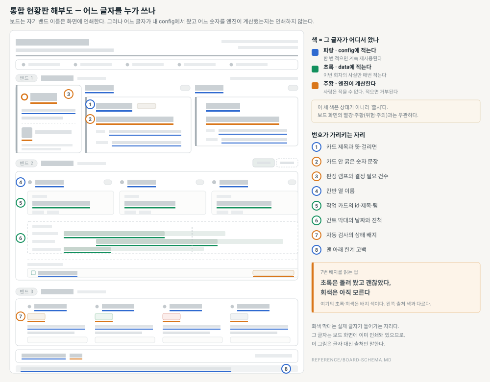

# integration-board 사용 안내서

> 여러 팀의 일이 하나의 제품으로 맞물리는지 보여 주는 현황판 HTML 한 장을, 매 실행 같은 판으로 만든다. 달라지는 것은 숫자뿐이다.

- **이럴 때 쓴다** — 여러 팀의 상태를 한 장에 모아 "지금 무엇을 결정해야 하나"를 보여야 할 때.
- **이럴 때 안 쓴다** — 한 팀의 할 일 목록일 때, 또는 판을 우리 마음대로 새로 디자인하고 싶을 때(판은 고정이다).
- **팀이 둘뿐이어도 된다** — 격자는 선언한 개수만큼 나뉜다. 아래 최소 예시도 팀 둘에 카드 하나다.
- **CI가 없어도 된다** — 검사를 선언하지 않으면 그 자리가 화면에서 사라지고, 보고하지 않은 검사는 초록이 아니라 회색 '정보 없음'으로 남는다.

## 무엇이 나오나 — 그리고 어느 글자를 누가 쓰나

보드는 세 밴드로 나온다. 아래 그림에서 회색 막대는 글자가 들어갈 자리이고, 색은 그 글자를 누가 쓰는지를 뜻한다.



범례도, 밴드 이름도, 카드의 뜻과 걸리면도 보드 화면이 스스로 인쇄한다. 그래서 이 안내서에 옮겨 적지 않는다.

## 5분 안에 띄워 보기

준비물이 없다. 엔진은 파이썬 표준 라이브러리만 쓰고, 인자를 생략하면 번들 예시로 데모를 그린다.

```bash
S=.claude/skills/integration-board/assets
python3 $S/integration_board_engine.py --out board.html
open board.html    # 브라우저로 그냥 열어도 된다
```

아래처럼 나오면 성공이다.

```
통합 현황판을 만들었습니다 → /home/me/proj/board.html
  판정 위험 · 결정 필요 2건 · 작업 12건(일정 미정 2) · 공용 자산 2 · 자동 검사 6(통과 3 · 미보고 1) · 76,073 bytes
```

## 우리 프로젝트로 바꾸기 — 이 14줄에서 이름만 바꾼다

아래 두 파일을 만들어 2절 명령에 `--config`와 `--data`로 물리면 우리 보드가 나온다. 따옴표 안의 이름과 설명만 우리 말로 바꾸면 그대로 돈다. 지켜볼 것을 늘리고 싶으면 마지막 절의 스키마 정본으로 간다.

`.integration/board.config.json` — 우리가 무엇을 지켜볼지. 분기에 한 번 바뀐다.

```json
{ "board":    { "title": "우리 팀 통합 현황판" },
  "lanes":    [ { "key": "cohesion", "label": "조화" } ],
  "areas":    [ { "key": "app", "label": "앱" } ],
  "statuses": [ { "key": "doing", "label": "진행 중", "tone": "blue" },
                { "key": "done",  "label": "배포완료", "tone": "green" } ],
  "assets":   [ { "key": "api", "label": "API 규격",
                  "plain": "여러 화면이 함께 의존하는 요청·응답의 모양",
                  "why":   "두 팀이 각자 바꾸면 남의 화면이 조용히 깨진다" } ],
  "cards":    [ { "key": "c1", "lane": "cohesion",
                  "title": "API 규격",
                  "plain": "여러 화면이 함께 의존하는 요청·응답의 모양",
                  "why":   "두 팀이 각자 바꾸면 남의 화면이 조용히 깨진다",
                  "metric": { "kind": "asset", "asset": "api" },
                  "decide": true } ] }
```

`.integration/board.json` — 이번 회차의 사실만. 실행할 때마다 바뀐다.

```json
{ "today": "2026-07-28",
  "works": [
    { "id": "W-1", "title": "결제 응답 구조 분리", "area": "app", "team": "A팀", "status": "doing",
      "block": "conflict", "touches": "api", "planStart": "2026-07-20", "planEnd": "2026-08-07" },
    { "id": "W-2", "title": "주문 목록 화면", "area": "app", "team": "B팀", "status": "done",
      "touches": "api", "planStart": "2026-07-10", "planEnd": "2026-07-24", "progress": 100 } ] }
```

## 막히면 — 엔진이 무엇이 틀렸는지 직접 알려 준다

검증에 걸리면 엔진은 아무 것도 만들지 않고, 어디가 어떻게 틀렸는지와 대신 쓸 수 있는 값을 모아서 알려 준다. 오류 사례를 미리 외울 필요가 없다.

```
통합 현황판 엔진 — 검증 실패 1건. 아무 것도 렌더하지 않았습니다.
  1. data.works[W-1].touches: 공용 자산 'apis'를 찾을 수 없습니다
       └ 선언된 값: api

스키마 정본: reference/board-schema.md
```

## 더 깊이 볼 곳

| 무엇이 궁금한가 | 어디를 보나 |
|---|---|
| 항목 하나하나의 규격, 지표 여덟 종, 검증이 막는 것 | [`reference/board-schema.md`](reference/board-schema.md) |
| 다 채워진 실제 예시 두 벌(웹 서비스 팀 · 하드웨어팀) | `assets/`의 `*example*.json` 네 개 |
| 클로드가 이 스킬을 어떤 절차로 도는가 | [`SKILL.md`](SKILL.md) |
| 이 안내서가 다시 길어지지 않았는지 | `python3 tools/check_readme.py` |
