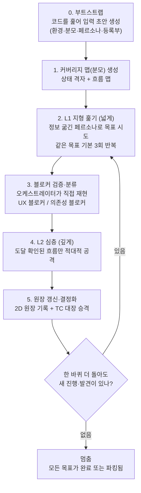

# QA Swarm

**한 줄 요지:** 시스템이 기능적으로 다 만들어진 뒤, 여러 페르소나(가상 이해관계자) subagent가 실제로 도는 앱을 직접 조작하며 **놓치기 쉬운 문제 — 엣지 케이스·막다른 흐름·불편함 — 을 찾아내고**, 오케스트레이터 한 명이 이들을 검증·취합해 2D 커버리지 원장에 기록하는 스킬이다.

> 상태: v0.1 · 아직 실전 검증 전(unproven). 첫 도입 프로젝트에서 돌려보며 다듬는 중이다. 이 스킬에 대한 변경은 `CHANGES.md`에만 As-Is/To-Be·역기능 형식으로 기록한다.

## 왜 이 스킬이 있나

품질 검증의 본질은 이미 아는 주요 기능을 다시 확인하는 것이 아니라, **놓치기 쉬운 것 — 엣지 케이스, 막다른 흐름, 불편함 — 을 찾아내는 것**이다.

문제는, 한 번에 다 떠올리려고 하면 눈에 띄는 몇 개만 나오고 나머지 대부분은 빠진다는 점이다. 사람이든 모델이든 한 번의 검토로는 문제 분포의 "머리"(눈에 잘 띄는 흔한 문제)만 잡고 "꼬리"(드물지만 실재하는 문제)를 놓친다. 그래서 포괄적 검증은 한 번의 분석으로 얻어지지 않는다. 여러 관점으로, 반복해서, 실제로 써보며 찾아야 얻어진다.

이 스킬은 그 탐색을 자동화한다.

## 무엇을 하나

이해관계자를 흉내 낸 여러 개의 subagent(페르소나)가 **실제로 돌아가는 앱을 직접 조작**하며 문제를 찾고, **오케스트레이터** 한 명이 이들을 띄우고, 검증하고, 정리한다.

검증을 두 개의 층으로 나눠 본다. 하나는 넓게 훑는 층이고 다른 하나는 깊게 파는 층이다.

| 층 | 별칭 | 핵심 질문 | 페르소나 성격 |
|---|---|---|---|
| **L1** | 지형, 넓게 | "처음 쓰는 사람이 이 일을 애초에 끝낼 수는 있나?" | 정보를 굶긴 첫 사용자 |
| **L2** | 심층, 깊게 | "정상적으로 되는 흐름을, 일부러 깨뜨릴 수 있나?" | 적대적 전문가 |

두 층은 순서로 이어진다. L1이 먼저 "여기까지는 도달 가능하다"를 확인해 주면, L2는 그 도달 가능한 흐름만 골라 깊게 공격한다.

## 딛고 선 원리 넷

**1. 정보를 굶기고, 우회를 막는다.**
L1 페르소나에게는 시스템 설명(사이트맵·라우트·문서)을 **주지 않는다**. 자기 분야는 알지만 이 시스템은 처음 보는 사람으로 둔다. 지도를 아는 순간 "첫 사용자"가 아니게 되기 때문이다. 그리고 막혔을 때 창의적으로 돌아가지 못하게 한다. 우회로가 있다는 것 자체가 이미 직관적 UX가 실패했다는 뜻이라, 우회로로 성공해 버리면 그 실패가 가려지기 때문이다.

**2. "다 봐야 할 목록(분모)"을 코드에서 만든다.**
"얼마나 꼼꼼히 봤나"를 재려면 먼저 "봐야 할 전체 목록"이 있어야 한다. 이 목록(분모)을 손으로 쓴 문서에 기대지 않고 **코드에서 뽑아 생성**한다. 코드는 어느 프로젝트에나 있고, 기계가 전수로 나열하므로 사람이 쓴 목록보다 빠짐이 적다.

**3. 발견한 것은 결정화한다.**
이 스킬이 하는 일은 **발견**이다. 발견을 확인하면 TC 대장(`tc-registry`, 테스트 케이스 등록부)에 적고, e2e(end-to-end, 앱을 실제 흐름대로 끝까지 구동하는) 테스트로 굳혀 재발을 막는다. 발견(새 문제 찾기)과 회귀 방지(아는 문제가 다시 깨지지 않게 지키기)는 다른 일이며, 서로를 먹인다.

**4. 파일이 아니라 기록을 늘린다.**
스웜은 **새 파일을 만들지 않는다**. 발견과 원장은 정해진 산출물 하나에 **줄만 덧붙인다**(발견마다 파일을 만들면 파일이 걷잡을 수 없이 늘어난다). 그리고 재현·증거가 없는 발견은 보고하지 않는다.

## 어떻게 도나 (파이프라인)

오케스트레이터의 자세(행동 지침)는 `agents/orchestrator.md`에 있다. 전체 흐름은 부트스트랩(0단계)에서 시작해 원장 갱신(5단계)까지 가고, 새로 진행·발견되는 것이 없어질 때까지 다시 앞으로 돌아 반복한다.

### 0. 부트스트랩 — 입력을 "만들어" 둔다

하네스(이 스킬을 돌리는 자동화 틀)는 **사람에게 백지에서 채우라고 요구하지 않는다.** 처음 돌 때 코드를 훑어 필요한 입력의 **초안을 생성해 파일로 떨궈 둔다.** 이것이 "그 원천은 누가 주나"에 대한 답이다. 하네스가 초안을 만들고, 사람은 확인·보정만 한다.

생성·탐지하는 것은 넷이다.

- **환경** — 앱 주소, 기동 방법, DB 연결 여부, 시드 스크립트 유무를 테스트 러너 설정과 프로젝트 파일에서 자동 탐지한다.
- **커버리지 맵(분모) 초안** — 원리 2대로 코드에서 생성한다(아래 1번 참조).
- **페르소나·목표 초안** — 코드의 역할(로그인 권한)과 진입 화면에서 "이 역할은 무슨 일을 하려 하나"를 뽑아 초안을 만든다.
- **등록부 초안** — 반발산 게이트(파일이 무한정 늘어나지 않게 막는 관문)가 쓸, 존재해도 되는 파일 목록.

사람이 직접 줘야 하는 것은 **자동으로 얻을 수 없는 것 하나 — 인증(역할별 로그인)** 뿐이다. 이것도 글이 아니라 테스트 러너의 로그인 셋업 스크립트로 둔다. 인증을 주지 못하면 로그인 없이 볼 수 있는 범위(주로 L1 도달성)까지만 돌고, 그 제약을 원장에 적는다.

그 "로그인 셋업 스크립트"의 구체 구현이 이 스킬에 들어 있다(Supabase 인증 + Playwright 스택 기준). `scripts/mint-auth-state.mjs` 가 테스트 유저로 로그인해 Playwright 가 물고 시작하는 저장 상태(storageState)를 발급하고, `scripts/authenticated-write-check.mjs` 가 그 세션이 로그인만이 아니라 **쓰기까지 되는지**를 실앱에서 확인한다. 준비물(1회 프로비저닝)·권한 모델·안전 규칙은 `authenticated-session.md` 에 있다. 이로써 인증이 갖춰지면 L2와 권한·쓰기 검증까지 자동으로 돌 수 있다.

**부트스트랩은 마지막에 "준비 상태 보드(신호등)"를 평가해 원장 맨 앞에 출력한다.** `qa-contract.md`의 전제조건 목록을 하나씩 자동 감지해 신호등을 매긴다 — 🟢(충족, 완전 가동) / 🟡(보완: 스킬이 초안을 생성하거나 등급을 강등해 계속 실행) / 🔴(차단: 실행 불가). **🔴가 될 수 있는 것은 "구동 앱" 하나뿐**이고, 없으면 실행을 거부하고 부족분만 보고한다. 나머지가 없으면 초안을 만들거나(분모·페르소나) 등급을 낮춰(인증·시드 등) 계속 돈다. 이 보드가 곧 "밖이 프로젝트마다 달라도 스킬이 스스로 등급을 매기고 그 사실을 드러내는" 통제 장치다. 각 항목의 판정 기준과 "없으면 대응"은 `qa-contract.md`에 있다.

### 1. 커버리지 맵(분모) 생성

두 종류의 분모를 코드에서 만든다. 하나는 L2가 쓰고 다른 하나는 L1이 쓴다.

- **상태 격자 (L2용 분모).** 화면(라우트), 역할, 동작, 상태값을 뽑아 그 조합을 표로 펼친 것이다. "이 상태에서 이 역할이 이 동작을 하면?"의 모든 칸이 여기서 나온다.
- **흐름 맵 (L1용 분모).** 역할별 진입 화면과, 그 역할이 쓸 수 있는 동작의 순서에서 "해내야 할 목표" 후보를 뽑은 것이다. 여기에 도메인 목표를 사람이 최소한만 보태 다듬는다.

프로젝트에 손으로 쓴 흐름 문서(예: user-flows)가 **있으면** 코드 맵과 합쳐(합집합) 완전성을 보강한다. 없어도 무방하다. 스웜이 흐름을 스스로 발견하기 때문이다.

이 맵이 원장의 분모가 된다. 스웜이 맵에 없던 흐름을 발견하면 맵에 추가한다. 즉 분모가 자란다.

**분모를 만드는 방법은 두 등급이다.** 라우트·역할·상태를 기계로 열거하는 스크립트가 있으면 그것으로 정밀하게 만든다(신호등 🟢). 스크립트가 없거나 아직 지원하지 않는 프레임워크면, 오케스트레이터가 코드를 읽어 판단으로 만들되 원장에 **"저신뢰 분모"로 표시**한다(🟡). 분모의 완전성이 이 스킬의 핵심 주장이므로, 기계 열거(스크립트)를 완성형으로 두고 판단은 그 폴백으로 둔다.

### 2. L1 지형 훑기 (넓게)

페르소나마다 `agents/l1-naive-user.md` 자세로 subagent를 띄운다. 정보를 굶긴 채, 실제 앱을 브라우저로 조작하게 한다(webapp-testing 활용). 각 에이전트는 목표를 자연스럽게 시도하다 막히면 멈춰서 "어디서, 무엇을 기대했는데, 무엇이 막았나"를 기록하고 다음 목표로 넘어간다.

같은 페르소나·목표를 여러 번(기본 3회) 돌린다. 막히는 지점이 **매번 같으면 확실한 블로커**이고, **매번 다르면 화면이 모호하다는 신호**다.

### 3. 블로커 검증·분류

오케스트레이터는 올라온 블로커를 **곧이곧대로 믿지 않고 직접 재현**한다. 스크린샷·상태 같은 증거로 재현되지 않으면 버린다. 재현되면 둘로 나눈다.

- **UX 블로커** — 순수한 화면 문제다(버튼이 없다, 막다른 길이다, 뭘 눌러야 할지 모르겠다). 고쳐야 할 결함이다.
- **의존성 블로커 (핸드오프)** — 다른 역할이 먼저 해줘야 하는 일을 기다리는 것이다(예: 품질 담당이 엔지니어의 릴리스를 기다림). 이건 결함이 아니라 정상적인 인계다. 다만 그 인계가 **매끄러운지(알림이 오는지) 아니면 깜깜한 대기인지**를 판정한다. 후자면 그게 발견이다.

### 4. L2 심층 (깊게, 도달 확인된 흐름만)

L1이 "도달 가능"으로 확인한 흐름에 대해서만, `agents/l2-adversary.md` 자세로 적대적 에이전트를 띄운다. 상태 격자·경계값·동시성·권한·잘못된 입력을 공격해 깨지는 지점을 찾는다.

### 5. 원장 갱신·결정화

2D 커버리지 원장(아래)을 갱신하고, 확인된 결함은 TC 대장에 줄로 덧붙여 이후 e2e 테스트로 승격한다.

### 반복과 멈춤

목표는 여러 단계로 이루어진다. 어느 단계에서 막히면 그 목표를 그 단계에 **세워두고(파킹)** 다른 목표로 넘어간다. 나중에 그 단계가 뚫리면 다시 이어서 시도하되, 모든 단계를 통과해야 성공이다.

**멈추는 조건:** 모든 목표가 완료되었거나 (블로커와 함께) 세워져 있고, 한 바퀴를 더 돌아도 새로 진행되거나 발견되는 것이 없을 때 멈춘다. 한 번만 돌고 끝내지 않는다. 반복이 꼬리(드문 문제)를 잡기 때문이다.

## 커버리지 원장 (2D)

원장은 `목표 × 단계` 격자다. 각 칸을 두 축으로 본다. 하나는 L1이 채우는 "거기까지 갈 수 있나"이고, 다른 하나는 L2가 채우는 "가서 깨뜨려도 버티나"이다.

| 축 | 채우는 층 | 가질 수 있는 값 |
|---|---|---|
| **도달성** | L1 | 통과 / 블로커(UX·핸드오프 + 사유) / 미도달 |
| **견고성** | L2 | 견고 / 엣지 결함 / 아직 도달 못 해 평가 안 됨 |

분모는 1번에서 생성한 커버리지 맵이다. 칸의 색으로 상태를 읽는다.

- **초록** — 실제로 쓸 수 있고 안 깨지는 칸.
- **빨강** — 결함.
- **빈칸** — 분모에는 있는데 아직 아무도 가보지 못한 곳. 즉 진짜 미지다.

그래서 두 수치가 자연히 잡힌다. "얼마나 검증됐나"는 초록 칸 수를 분모로 나눈 값이고, "미지"는 빈칸의 수다. 분모가 코드에서 생성되므로, 어느 프로젝트에서든 꼼꼼함을 수치로 측정할 수 있다.

원장과 발견은 오케스트레이터가 소유한 저장소 하나에 덧붙인다. 발견마다 새 파일을 만들지 않는다.

## 정직성의 한계와 보고

- **합성 에이전트는 사람이 아니다.** 구조·논리 문제(길이 없다, 상태가 안 맞다, 인계가 끊긴다)는 잘 잡지만, "사람이 보면 헷갈리는데 에이전트는 그냥 읽어버리는" 감성적 불편은 덜 잡는다. 그래서 이 스킬은 사람 사용성 테스트의 **대체가 아니라, 1차로 대량을 걸러내고 "사람이 직접 봐야 할 후보"를 뽑아 주는 도구**다.
- **커버리지는 정직하게.** 못 돈 목표, 채워지지 않은 인증, 실행하지 못한 레이어는 원장에 빈칸으로 남긴다. 침묵으로 "다 됐다"처럼 보이게 하지 않는다.
- **검증 없는 발견은 보고하지 않는다.**

보고는 채팅으로 한다. 다섯 가지를 담는다.

1. 발견 요약 (심각도와 관점별: 구조·논리·편의·오류)
2. 2D 원장 (초록·빨강·빈칸 수)
3. 핸드오프 마찰 지도 (의존성 블로커 모음)
4. TC 대장에 추가할 결정화 항목
5. 사람 사용성 테스트가 필요한 후보
