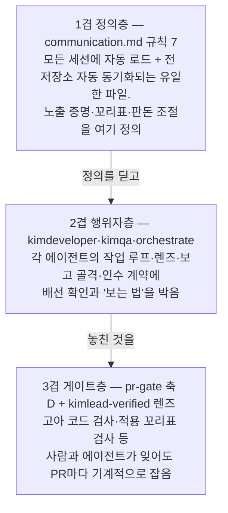

# KimLead 팀의 완료 기준 교정 — 검토 결과, 개발 계획, 실행 결과

> **한 줄 요지:** 창고(Template-repository)의 에이전트·게이트 전반에 완료 기준이 "코드가 있고 빌드·테스트가 통과한다"로 박혀 있어, 만들어 놓고 화면에 안 보이는 것(배선 누락)과 커밋만 하고 실환경에 안 적용한 것(적용 누락)이 "구현 완료"로 보고돼 왔다. 이를 고치는 방법은 문구 수정이 아니라 **3겹 방어**다 — (1) 정의층: 모든 세션에 자동 로드되는 communication.md 규칙 7에 "노출 증명" 요건을 심고, (2) 행위자층: KimDeveloper·KimQA·KimLead의 작업 루프와 보고 골격에 배선·적용 확인을 박고, (3) 게이트층: pr-gate에 "만들었지만 실제로는 한 번도 실행되지 않는 코드"를 기계적으로 잡는 검사를 신설한다.

> **문서의 상태:** 이 문서는 계획으로 작성된 뒤 실제로 실행됐다. 1~7단계의 파일 수정과 8단계의 소급 검증까지 반영돼 있으며, 실행에서 계획이 틀렸던 부분(고아 코드 검사만으로는 실제 사고를 잡지 못한다는 것)도 §5에 그대로 남겼다.

---

## 이 문서가 다루는 문제 — 두 개의 구멍

이 문서는 다음 사건에서 출발한다. 개발 세션이 "P1b 구현 완료"를 보고했지만, 실제로는 그 엔진을 켜는 선언(호출부)이 없어 화면에 단 한 번도 나타난 적이 없었다. 별도로, 데이터베이스 마이그레이션(DB 구조를 바꾸는 스크립트)을 파일로 커밋만 하고 실제 DB에 적용하지 않아 코드는 있으나 실환경에서 동작하지 않는 일도 있었다. 두 사건의 공통 원인은 하나다 — **팀 전체의 완료 정의가 "코드가 있고 테스트가 통과한다"에서 멈춰 있고, "사용자(대표)가 화면에서 실제로 볼 수 있다"까지 가지 않는다.**

두 구멍에 이름을 붙여 이후 계속 쓴다.

| 이름 | 무엇인가 | 왜 기존 기준을 통과하나 |
|---|---|---|
| **배선 누락(wiring gap)** | 엔진·컴포넌트를 만들었지만, 그것을 화면에 노출하는 연결(라우트 등록, 네비게이션 메뉴, 기능 활성화 스위치, 호출부)이 없다 | 유닛 테스트는 엔진을 **직접 호출**하므로 통과한다. 빌드도 통과한다. 사용자만 도달하지 못한다 |
| **적용 누락(apply gap)** | 마이그레이션·설정 변경을 파일로 커밋했지만 실제 환경(DB·배포)에 적용하지 않았다 | 파일은 저장소에 있으므로 "코드가 있다"는 참이다. 실환경만 옛날 그대로다 |

핵심 통찰은 이것이다. 배선 누락은 **테스트가 잡을 수 없는 종류의 결함**이다. 테스트는 "이 코드를 부르면 맞게 동작하나"를 묻는데, 배선 누락의 문제는 "아무도 이 코드를 부르지 않는다"이기 때문이다. 그래서 해법은 테스트를 더 쓰는 것이 아니라, **"누가 이것을 부르나 / 사용자는 어디서 이것에 닿나"를 별도의 확인 대상으로 승격**하는 것이다.

---

## 1. 검토 결과 — 낡은 기준이 박혀 있는 위치 전수 목록

창고의 `.claude/` 전체(에이전트 5, 커맨드 4, 워크플로 2, 규칙 1)를 읽고, "완료·검증·통과"를 정의하는 문장을 전부 찾았다. 결론부터 말하면 **낡은 기준은 한 파일의 실수가 아니라 6개 파일에 일관되게 박힌 시스템 전체의 전제**다. 각 파일이 서로를 인용하므로("KimDeveloper는 빌드·테스트로 확인된 코드를 돌려준다"), 한 곳만 고치면 나머지가 옛 기준을 다시 주입한다.

### 1-1. `.claude/agents/kimdeveloper.md` — 근원지

개발자 에이전트의 완성 선언 기준 자체가 "실행 검증"에서 멈춘다. 배선 누락 사고의 직접 원인이다.

| 위치 | 문장 (요지) | 어떻게 사고에 기여하나 |
|---|---|---|
| 한 줄 요지 (9행) | "실제로 빌드·실행·테스트해 동작을 확인한 뒤에야 완성을 선언한다" | 완성의 필요조건만 있고 충분조건이 없다. 엔진을 직접 호출하는 테스트만 통과해도 이 문장은 만족된다 — P1b가 정확히 이 경로로 "완료" 보고됐다 |
| §3 원칙 1 (42행) | "실행해 확인하지 않은 코드는 완성이 아니다" | 대우인 "노출되지 않은 코드는 완성이 아니다"가 없다. 개발자의 자아 정의에 도달성 개념 자체가 부재 |
| §4 구현 루프 E단계 (59행) | "실제로 실행·검증한다 — 빌드/실행/테스트로 동작을 관찰" | 검증의 **출발점**이 명시돼 있지 않다. 만든 유닛에서 출발하면 통과하고, 사용자 진입점(메뉴·링크)에서 출발해야만 배선 누락이 걸린다 |
| §5 렌즈 4 성공 기준 렌즈 (85행) | "그 기준을 테스트나 실행으로 실제로 확인했는가" | 네 렌즈(가정·단순성·범위·성공 기준) 어디에도 "사용자가 여기 닿을 수 있나"를 묻는 렌즈가 없다 |
| §7 보고 골격 (109~116행) | 결과 / 설계·구현 판단 / 갈리는 선택 / 남은 것 | 보고에 "어디서 어떻게 보는지" 절이 없어, 보고를 쓰는 과정에서 스스로 배선 누락을 발견할 기회도 없다 |
| §9 금지 목록 (144행) | "데이터 마이그레이션은 지시가 명확하지 않으면 먼저 확인" | 적용을 조심하라고만 하고, **적용하지 않은 채로 완료를 선언하는 것을 막는 조항이 없다**. 그 결과 "위험하니 적용은 안 하고, 파일만 커밋하고, 완료 보고"라는 적용 누락의 정석 경로가 열려 있다 |

### 1-2. `.claude/commands/orchestrate.md` (KimLead) — 낡은 기준을 계약으로 굳힌 곳

리드가 개발자에게서 **무엇을 받기로 돼 있는지**가 낡은 기준으로 정의돼 있어, 개발자가 옛 기준으로 보고해도 리드가 그대로 수납한다.

| 위치 | 문장 (요지) | 어떻게 사고에 기여하나 |
|---|---|---|
| §4 팀 명부 (55행) | KimDeveloper에게서 돌려받는 것 = "빌드·실행·테스트로 동작 확인된 코드와 보고" | 리드와 개발자 사이의 **인수 계약** 자체가 낡은 기준이다. 개발자가 배선 없이 보고해도 계약 위반이 아니다 |
| §5 표준 파이프라인 (70~93행) | 개발(G) 다음이 곧장 QA(H), 물려주는 것은 "그 화면·실행 방법" | 개발이 QA에게 "실행 방법"(예: 이 URL로 직접 들어가라)을 알려 주면, QA는 지도를 받은 상태가 되어 **네비게이션에 진입점이 없다는 사실을 못 본다**. 배선 누락이 QA 단계도 통과하는 경로다 |
| §7 검증 게이트 (113행) | 관점 패널의 렌즈 = 정확성 / 완결성 / 기존 규약과의 일관성 / 재현성 | 판돈 큰 산출에 붙이는 검증 렌즈 목록에 "사용자 도달 가능성"이 없다. 게이트를 열어도 배선 누락은 걸리지 않는다 |
| §8 보고 골격 (126~130행) | 결과 / 어떻게 지휘했나 / 결정 필요 / 남은 것 | 최종 통합 보고에도 "어디서 보는지"와 규칙 7 상태 표기가 골격에 없다 |

### 1-3. `.claude/agents/kimqa.md` — 마지막 그물의 구멍

QA는 "실행되는 시스템을 사용자처럼 써 본다"고 하지만, **새로 만든 기능이 애초에 화면에서 도달 가능한지**를 명시적 관문으로 두지 않는다.

| 위치 | 문장 (요지) | 어떻게 사고에 기여하나 |
|---|---|---|
| §4 QA 루프 C단계 (57행) | "대상을 실제로 띄운다" | 앱을 띄우는 것과, **새 기능이 그 앱 안에서 보이는지**는 다른 문제다. 검증 대상 도달성 확인이 단계로 없다 |
| §4 서브에이전트 제약 (59행) | 서브에이전트로 불리면 스웜 대신 렌즈를 혼자 갈아 끼운다 | 축소 모드에서는 qa-swarm의 L1(정보를 굶긴 첫 사용자 — 사실상 유일하게 배선 누락을 잡는 층)이 약해진다. 축소 모드일수록 도달성 확인을 **명시적 의무**로 박아야 하는데 그 조항이 없다 |
| §6 보고 골격 (81~85행) | 판정 / 발견 / 커버리지 / 남은 것 | "검증 대상에 제품의 정상 경로로 도달했는가"라는 판정 항목이 없다 |

참고로 `qa-swarm` 스킬 자체는 설계가 옳다 — L1 페르소나에게 정보를 굶기고 우회를 금지하는 원리가 정확히 배선 누락을 잡는 장치다. 문제는 kimqa가 서브에이전트 축소 모드로 돌 때와, 판돈이 작아 스웜을 안 돌릴 때 이 그물이 사라진다는 점이다.

### 1-4. `.claude/rules/communication.md` 규칙 7 — 어휘의 구멍

세 단계 어휘(작업완료 / 검토대기 / 배포완료)는 "다음 단계로 누가 보내나"를 잘 가르지만, **각 상태를 선언하기 위한 증명 요건**이 비어 있다.

- **"작업완료 = 산출물을 만들고 검증한 뒤 커밋·푸시"** — 여기서 '검증'이 무엇인지 정의가 없다. 빌드·테스트 통과를 검증으로 읽으면 배선 누락이 그대로 "작업완료"가 된다. 실제로 그렇게 읽혀 왔다.
- **"배포완료 = main에 머지되어 실제로 반영된 상태"** — 마이그레이션이 미적용이면 main에 머지돼도 실환경은 반영 전이고, 배선이 없으면 배포가 나가도 화면에는 안 보인다. 즉 현재 정의로는 **배포완료조차 "화면에서 보인다"를 보장하지 않는다.**

한 가지 좋은 선례가 이미 있다. `/sysreport`(39행)는 "라이브 DB 미적용 같은 '코드는 됐으나 실반영 대기' 상태는 눈에 띄게 표시한다"고 적고 있다 — 적용 누락을 꼬리표로 드러내는 발상이 시스템에 이미 존재하므로, 이것을 규칙 7로 끌어올려 전사 표준으로 만들면 된다.

### 1-5. `.claude/commands/pr-gate.md` — 기계적으로 잡을 수 있는데 안 잡는 곳

세 축(문서 갱신 / 척추 준수 / 타 파트 영향) 어디에도 배선·적용 검사가 없다. 그러나 이 게이트야말로 **배선 누락을 기계적으로 잡기에 가장 좋은 지점**이다. 이유는 이렇다. 배선 누락은 코드 관점에서 "새로 만든 모듈을 참조하는 곳이 (자기 자신과 테스트 밖에) 하나도 없다"는 **고아 코드(orphan code)** 패턴으로 나타나고, 이것은 grep(텍스트 검색)으로 판정 가능하다. 프롬프트 속 다짐은 잊히지만, PR마다 도는 검사는 잊히지 않는다.

현재 축 A가 "마이그레이션 추가 시 문서 3종 갱신"은 확인하면서 **"그 마이그레이션이 어디에 적용됐거나 적용 계획이 명시됐는가"는 확인하지 않는** 것도 같은 구멍이다.

### 1-6. `.claude/workflows/kimlead-verified.js` — 기본 렌즈의 구멍

26~30행의 기본 렌즈가 정확성 / 완결성 / 일관성 셋뿐이다. "완결성" 렌즈는 "빠진 단계·조건·예외"를 보게 돼 있어 언뜻 배선 누락을 잡을 것 같지만, 검토 대상이 산출물 자체이므로 **산출물 바깥의 연결(누가 이것을 부르나)**은 완결성 렌즈의 시야에 안 들어온다. 도달 가능성은 별도 렌즈여야 한다.

### 1-7. 검토했으나 이번 범위에서 수정 불요로 판단한 곳

- **`kimdesigner.md`** — 디자이너는 "렌더해 눈으로 본다"가 이미 척추라 노출 개념이 내장돼 있다.
- **`sysreport.md` / `merge-gate.md`** — 규칙 7을 인용만 하므로, 규칙 7을 고치면 자동으로 따라온다. sysreport의 "미적용 꼬리표"는 오히려 이번 수정의 선례다.
- **하위 저장소의 `CLAUDE.md` 작업 규칙** (예: Hardware-Team-System의 "빌드·실행하고 pnpm test로 확인한 뒤 커밋") — 같은 낡은 기준이지만 CLAUDE.md는 저장소별 파일이라 창고 동기화 범위 밖이다. 결정 필요 4번으로 올린다.

---

## 2. 새 완료 기준의 정의 — "만든 것"이 아니라 "닿는 것"이 완료다

### 2-1. 원칙 한 문장

**작업의 완료는 산출물의 존재가 아니라, 그 산출물에 사용자가 정상 경로로 닿을 수 있고 실환경에서 실제로 동작한다는 증명으로 선언한다.** 이 증명을 **노출 증명(visibility proof)**이라 부른다.

노출 증명은 두 요소로 구성된다.

1. **배선 확인** — 사용자가 제품의 정상 진입점(네비게이션 메뉴, 기존 화면의 링크·버튼)에서 출발해 클릭만으로 새 기능에 도달할 수 있다. URL을 직접 쳐서 들어가는 것(딥링크)은 배선 확인이 아니다 — 대표는 URL을 모른다.
2. **적용 확인** — 동작에 필요한 환경 변화(마이그레이션, 설정, 기능 활성화 스위치, 시드 데이터)가 검증한 환경에 실제로 적용돼 있다. 적용하지 않았다면 그 사실을 **"실환경 적용 대기" 꼬리표**로 보고에 눈에 띄게 명시한다 — 침묵이 금지이지, 미적용 자체가 금지가 아니다(실환경 적용은 사람 승인이 필요할 수 있으므로).

### 2-2. 산출물 유형별 증명 방법 — "화면"이 없으면 무엇으로 증명하나

"화면에서 보인다"를 문자 그대로 모든 작업에 적용하면 백엔드·문서 작업에서 기준이 붕괴한다. 유형별로 "닿는다"의 의미를 정의한다.

| 산출물 유형 | "닿는다"의 의미 | 요구하는 증명 |
|---|---|---|
| **새 화면·새 UI 기능** | 대표가 메뉴·링크에서 클릭으로 도달해 눈으로 본다 | (a) 진입점 존재(네비·링크 등록), (b) **진입점에서 출발하는** e2e 테스트(앱을 실제 사용자 흐름대로 끝까지 구동하는 테스트) 통과, (c) 스크린샷 1장, (d) 보고에 "보는 법" 경로 |
| **기존 화면 안의 수정** | 기존 진입점에서 바뀐 모습이 보인다 | 해당 화면 e2e 또는 실행 확인 + 보고에 "보는 법". 새 진입점이 없으므로 배선 확인은 생략 |
| **백엔드·API·엔진 (UI 없음)** | 실제 소비자(화면 또는 다른 서비스)가 이것을 호출한다 | 호출부가 존재함을 코드로 제시(파일·행). 호출부가 의도적으로 아직 없으면 **"미배선 — 후속 PR에서 연결"을 보고에 명시** — P1b는 정확히 이 명시가 없어서 사고가 됐다 |
| **DB 마이그레이션** | 대상 환경의 DB에 실제로 반영돼 있다 | 로컬(또는 스테이징) 적용·검증 로그 + 실환경 적용 상태를 꼬리표로 명시("적용됨" 또는 "실환경 적용 대기 — 승인 필요") |
| **문서·규칙** | 읽을 사람이 참조 경로로 찾아 들어온다 | 상위 문서(CLAUDE.md·README·목차)에서 링크되는가 + 검토용이면 아티팩트 게시. 고아 문서(아무 데서도 링크 안 됨)는 배선 누락의 문서판이다 |
| **순수 리팩터·버그 수정** | 기존 동작이 그대로 산다(회귀 없음) | 기존 e2e·테스트 통과로 충분. 노출 증명 대상이 아니다 |

### 2-3. 보고의 "보는 법" 절 — 가장 싸고 즉효인 장치

노출이 필요한 모든 작업의 보고에 다음 세 줄을 의무화한다.

- **어디서:** URL 또는 메뉴 경로 (예: "홈 > Quality > DRBFM 목록")
- **무엇을 하면:** 재현 조작 (예: "Change를 열고 8단계 탭 클릭")
- **무엇이 보이나:** 기대 결과 (예: "diff 비교 화면이 뜬다")

이 세 줄이 강력한 이유는 검사가 아니라 **자기 발견 장치**이기 때문이다. "어디서"를 쓰려고 하는 순간, 배선이 없으면 쓸 내용이 없어 작성자가 스스로 누락을 발견한다. P1b의 보고에 이 절이 있었다면 보고가 나가기 전에 걸렸다.

### 2-4. 판돈 조절 — 언제 전체 증명을, 언제 생략을

모든 변경에 스크린샷을 요구하면 그것대로 실패다(문서 오타 수정에 e2e를 붙이는 팀은 곧 규칙을 무시하게 된다). 발동 조건을 변경의 성격으로 가른다.

| 변경의 성격 | 요구 수준 |
|---|---|
| **새 진입점을 만들었거나 만들어야 했던 변경** (새 화면, 새 기능, 새 엔진, 새 워크플로) | 노출 증명 전체 (2-2 표의 해당 행 전부) |
| **기존 진입점 안의 변경** (기존 화면 수정, 버그 수정, 리팩터) | 실행 확인 + "보는 법" 한 줄. 스크린샷·신규 e2e 불요 |
| **환경을 바꾸는 변경** (마이그레이션, 설정, 활성화 스위치) | 변경 크기와 무관하게 **적용 상태 꼬리표 의무** — 이것은 한 줄이라 부담이 없고, 침묵만 막으면 된다 |
| **노출과 무관한 변경** (문서 오타, 주석, 내부 도구) | 기존 기준 그대로. 노출 증명 생략 |

---

## 3. 개발 계획 — 어떤 파일을 어떤 순서로 어떻게 고치나

수정 전략의 뼈대는 **3겹 방어**다. 프롬프트 속 다짐은 잊히므로(이번 사고의 반성문이 그 증거다), 잊혀도 잡히는 구조를 만든다.



단계는 정의를 먼저 확정하고(0·1), 그 정의를 행위자에 심고(2~4), 게이트로 굳힌 뒤(5·6), 과거 사고로 소급 검증한다(7·8).

### 0단계 — 기준 확정 (완료)

- **파일:** 없음 (이 문서의 "결정 필요" 4절)
- **내용:** 결정 필요 1~5번의 답을 받는다.
- **왜 먼저:** 특히 "대표가 보는 환경이 어디인가"(결정 2)가 정해지지 않으면 노출 증명의 목적지 자체가 애매하다.
- **결과:** 다섯 건 모두 권고안대로 승인됐다(4절 표에 각 항목의 확정 내용을 표시). 이후 단계는 그 결정을 전제로 실행됐다.

### 1단계 — `.claude/rules/communication.md` 규칙 7 확장 (정의층)

- **바꿀 내용의 요지:**
  - "작업완료" 정의의 '검증'을 명시한다 — "검증에는 실행 확인과 **노출 증명**(배선 확인 + 적용 확인, 2절 정의)이 포함된다. 노출 증명 없이 작업완료를 선언하지 않는다."
  - 유형별 증명 표(2-2)와 판돈 조절 표(2-4)를 규칙 7 하위에 넣는다.
  - **"실환경 적용 대기" 꼬리표**를 예약어로 추가한다 — 마이그레이션·설정이 실환경 미적용이면 상태 표기 옆에 반드시 붙인다(sysreport의 기존 관행을 전사 표준으로 승격).
  - 보고 말미 상태 표기 예시에 "보는 법" 세 줄을 포함시킨다.
- **왜 이 파일이 1순위:** 이 파일은 (a) 모든 세션에 자동 로드되어 **모든 에이전트가 이미 딛고 서는 유일한 바닥**이고, (b) 동기화 봇으로 전 저장소에 자동 배포되는 단일 원본이다. 여기 심으면 서브에이전트가 자기 정의 파일만 읽어도 기준이 컨텍스트에 들어온다.

### 2단계 — `.claude/agents/kimdeveloper.md` (행위자층의 근원지)

- **바꿀 내용의 요지:**
  - §3 원칙 1에 대우 문장을 추가한다: **"노출되지 않은 코드도 완성이 아니다.** 테스트는 '부르면 맞게 도나'만 답하고 '누가 부르나'는 답하지 못한다. 사용자 진입점에서 도달을 확인하기 전까지 완성을 선언하지 않는다."
  - §4 구현 루프의 E단계(실행 검증)를 **"진입점에서 출발하는 실행 검증"**으로 바꾼다 — 만든 유닛이 아니라 사용자가 서는 곳(메뉴·링크)에서 출발해 새 기능까지 클릭으로 닿는지 관찰한다.
  - §5 렌즈 뒤의 "마지막 실행 검증"에 **배선 질문**을 넣는다: "내가 만든 것을 부르는 곳이 (자신과 테스트 밖에) 있는가? 없다면 배선이 내 일이었는가, 아니면 '미배선'을 보고에 명시해야 하는가?"
  - §7 보고 골격에 **"보는 법"** 절(어디서 / 무엇을 하면 / 무엇이 보이나)을 추가하고, 마이그레이션·설정 변경 시 **적용 상태 꼬리표**를 의무화한다.
  - §9에 한 줄 추가: "마이그레이션을 파일로만 커밋하고 침묵하지 않는다 — 적용했으면 로그를, 안 했으면 '실환경 적용 대기'를 보고에 남긴다."
- **왜:** 배선·적용 누락이 태어나는 곳이 개발 단계다. 여기서 잡히면 뒤의 모든 층이 보험이 된다. 기존 네 렌즈(andrepathy의 네 실수와 일대일)는 구조를 보존하고, 배선 확인은 렌즈가 아니라 "마지막 실행 검증"의 일부로 넣어 문서의 기존 뼈대를 깨지 않는다.

### 3단계 — `.claude/agents/kimqa.md` (마지막 그물 보강)

- **바꿀 내용의 요지:**
  - QA 루프에 **"0번 관문 — 도달성"**을 추가한다: 본 검증에 들어가기 전, 호출자가 준 경로·URL을 **쓰지 않고** 제품의 정상 진입점에서 검증 대상까지 도달을 시도한다. 도달 불가면 그 자체가 **차단급 결함**("만들어졌으나 배선되지 않음")이며 즉시 보고한다.
  - 서브에이전트 축소 모드 조항에 명시한다: 스웜을 못 띄우는 축소 모드에서도 0번 관문(도달성)만은 생략하지 않는다 — L1이 하던 일의 최소 보존분이다.
  - §6 보고 골격의 "판정"에 도달성 판정(정상 경로 도달 가능 / 불가)을 포함시킨다.
- **왜:** qa-swarm의 "정보를 굶긴 첫 사용자" 원리가 배선 누락을 잡는 유일한 사후 그물인데, 축소 모드·저판돈 실행에서 사라진다. 최소 보존분을 의무로 박아 그물의 구멍을 막는다.

### 4단계 — `.claude/commands/orchestrate.md` (인수 계약과 물림 교정)

- **바꿀 내용의 요지:**
  - §4 팀 명부에서 KimDeveloper의 반환물 정의를 바꾼다: "빌드·실행·테스트로 동작 확인된 코드" 를 **"동작 확인되고 노출 증명(또는 '미배선'·'적용 대기' 명시)까지 담긴 코드와 보고"**로. 리드가 노출 증명 없는 개발 보고를 받으면 **수납을 거부하고 개발로 되돌리는** 것을 명시한다.
  - §5 파이프라인의 개발→QA 물림을 교정한다: QA에게 실행 방법(구동 명령·계정)은 실어 주되, **화면 내 위치·URL은 일부러 주지 않는다** — QA가 정상 진입점에서 스스로 도달해야 배선이 검증된다. (개발이 보고한 "보는 법"은 QA의 도달 결과와 대조용으로만 쓴다.)
  - §7 검증 게이트의 관점 패널 렌즈에 **"사용자 도달 가능성"**을 추가한다.
  - §8 최종 보고 골격에 규칙 7 상태 표기와 "보는 법"을 포함시킨다.
- **왜:** 리드는 팀의 인수 기준을 정하는 자리다. 계약이 낡은 채면 개발·QA를 고쳐도 리드가 옛 기준으로 통합 보고를 쓴다.

### 5단계 — `.claude/workflows/kimlead-verified.js` (기본 렌즈 1줄 추가)

- **바꿀 내용의 요지:** 26~30행 기본 렌즈 배열에 넷째 렌즈를 추가한다: `'도달 가능성 — 사용자가 제품의 정상 진입점에서 이 산출에 실제로 닿을 수 있는가; 만들어 놓고 아무 곳에서도 부르지 않는(배선되지 않은) 요소가 없는가'`.
- **왜:** 판돈 큰 검증이 정형 워크플로로 돌 때도 같은 렌즈가 보장되게 한다. 코드 한 줄이라 비용이 거의 없다.

### 6단계 — `.claude/commands/pr-gate.md` 축 D 신설 (게이트층 — 이 계획의 기계적 심장)

- **바꿀 내용의 요지:** 기존 세 축(문서 / 척추 / 타 파트) 옆에 **"축 D — 배선·적용"**을 신설한다. 검사 항목:
  1. **고아 코드 검사:** diff에 새로 추가된 컴포넌트·모듈·엔진(export되는 것)마다, 자기 파일과 테스트 파일 **밖에서** 그것을 import·호출하는 곳이 있는지 grep으로 확인한다. 없으면 "고아 후보"로 판정하고, PR 설명에 "의도적 미배선(후속 PR에서 연결)" 명시가 있으면 **주의**로, 없으면 **차단 후보**로 올린다.
  2. **새 화면 진입점 검사:** 새 페이지·라우트가 diff에 있으면, 네비게이션·메뉴·기존 화면 링크에 그 진입점을 등록하는 변경이 같은 PR에 있는지 확인한다.
  3. **e2e 출발점 검사:** 새 기능의 e2e 테스트가 진입점(홈·메뉴)에서 출발하는지, URL 직행으로 시작하는지 본다. URL 직행뿐이면 지적한다.
  4. **적용 꼬리표 검사:** `supabase/migrations/` 등 환경을 바꾸는 파일이 diff에 있으면, PR 설명에 적용 상태(적용 로그 또는 "실환경 적용 대기")가 명시됐는지 확인한다. 없으면 **차단 후보**.
  5. **죽은 스위치 검사(실행 중 추가됨):** 새 코드가 설정값·모드 문자열을 읽는 조건 뒤에 있으면, 그 조건을 만족시키는 값이 데이터·시드·마이그레이션·설정에 실제로 있는지 확인한다. **이 검사는 계획에 없었고, 8단계 소급 검증에서 검사 1이 실제 사고를 통과시킨다는 사실이 드러나 추가됐다**(§5-2).
- **의도적 단계 커밋의 오탐 방지:** "엔진 먼저, 배선은 다음 PR" 전략은 정당하다. 축 D는 그것을 막지 않고 **침묵만 막는다** — 명시가 있으면 통과(주의), 명시가 없으면 차단. 이 구분이 판돈 조절의 게이트판이다.
- **왜 마지막 겹인가:** 1~5단계는 전부 프롬프트(의지)다. 이번 사고의 교훈이 "의지는 잊힌다"이므로, 잊혀도 PR마다 기계적으로 도는 검사가 반드시 하나는 있어야 한다. 고아 코드는 grep으로 판정 가능해서 이 검사가 실제로 기계화된다. (1차는 게이트 프롬프트의 지시로 넣고, 오탐률을 본 뒤 스크립트로 굳히는 것은 후속 — 결정 5.)

### 7단계 — 하위 저장소 CLAUDE.md 작업 규칙 갱신 (결정 4 승인 시)

- **파일:** `Hardware-Team-System/CLAUDE.md` 등 각 저장소의 "작업 규칙" 절
- **바꿀 내용의 요지:** "빌드·실행하고 pnpm test로 확인한 뒤 커밋"에 "화면 노출 확인(노출 증명은 communication.md 규칙 7)"을 덧붙인다.
- **왜:** CLAUDE.md는 저장소별 파일이라 창고 동기화가 닿지 않는다. 여기가 옛 기준으로 남으면, 창고를 다 고쳐도 각 저장소 세션이 자기 CLAUDE.md에서 옛 기준을 다시 읽는다.

### 8단계 — 소급 검증: 이 장치가 P1b를 잡았을지 확인

- **내용:** 수정을 마친 뒤, P1b(엔진 미배선)와 마이그레이션 미적용이 있던 실제 커밋·PR에 새 pr-gate(축 D 포함)를 소급 실행해 본다. 두 사고가 모두 "차단"으로 걸리면 장치가 유효한 것이고, 안 걸리면 검사 문구를 다시 조인다.
- **왜:** 이 작업 자체의 완료 기준도 "규칙 문서가 존재한다"가 아니라 "사고가 실제로 걸린다"여야 한다 — 새 완료 기준을 이 작업에 자기 적용하는 것이다.

### 순서와 이유 요약

정의(1)가 없으면 행위자(2~4)가 참조할 곳이 없고, 행위자를 안 고치면 게이트(6)가 잡은 것을 되돌릴 주체가 없으며, 게이트가 없으면 행위자의 다짐이 다시 잊힌다. 세 겹이 다 있어야 하고, 순서는 참조 방향(정의를 딛고 행위자가, 행위자를 게이트가 받친다)을 따른다.

---

## 4. 결정 사항 — 갈림길과 확정된 답

각 항목에 권고안을 달아 올렸고, **다섯 건 모두 권고안대로 승인됐다.** 따라서 아래 "권고안" 열은 곧 확정된 결정이다.

| # | 갈림길 | 선택지 | 권고안 (= 확정된 결정) |
|---|---|---|---|
| 1 | **새 기준의 정의를 어디에 두나** | (가) communication.md 규칙 7을 확장 / (나) 별도 규칙 파일(예: rules/definition-of-done.md) 신설 | **(가) 규칙 7 확장.** 규칙 7이 이미 상태 어휘의 자리이고, communication.md만이 자동 로드·자동 동기화된다. 새 파일은 각 저장소의 로드 설정을 전부 고쳐야 해서 그 자체가 배선 누락의 위험을 진다 |
| 2 | **"대표가 보는 화면"의 환경은 어디인가** — 노출 증명의 목적지 | (가) 로컬 실행 화면이면 충분 / (나) 스테이징(공유 검증 환경) / (다) 프로덕션(실서비스) | **(가) 작업완료 시점엔 로컬로 충분하되, 배포완료 선언에는 실환경 노출 확인을 요구.** 로컬 증명 없이는 아무것도 못 믿고, 프로덕션 확인은 머지·배포 뒤에만 가능하므로 상태별로 목적지를 나누는 것이 자연스럽다 |
| 3 | **실환경(라이브 DB) 적용을 누가 하나** | (가) Claude가 승인 없이 적용까지 / (나) Claude는 로컬 적용·검증까지, 실환경 적용은 사람 승인 후 별도 단계 | **(나).** 실DB 변경은 되돌리기 어려운 행동이라 기존 안전 규칙과 정합해야 한다. 대신 "실환경 적용 대기" 꼬리표를 의무화해 적용 누락이 침묵 속에 남는 것만 막는다 |
| 4 | **하위 저장소 CLAUDE.md도 이번에 같이 고치나** | (가) 창고만 먼저, 하위는 다음에 / (나) 같은 작업에서 Hardware-Team-System CLAUDE.md까지 | **(나).** 실제 개발이 도는 곳은 하위 저장소이고, 그 세션이 매번 읽는 CLAUDE.md가 옛 기준이면 창고 수정의 효과가 반감된다. 파일 한 곳, 한 문장 수정이라 비용도 작다 |
| 5 | **pr-gate 고아 코드 검사의 구현 수준** | (가) 게이트 프롬프트의 지시(LLM이 grep 수행) / (나) 처음부터 결정론적 스크립트 | **(가)로 시작.** 프레임워크마다 import 패턴이 달라 스크립트를 처음부터 굳히면 오탐·미탐 조정이 어렵다. 프롬프트 지시로 두어 번 돌려 패턴을 확인한 뒤 스크립트로 승격한다(그때가 별도 작업) |

---

## 5. 실행 결과 — 무엇을 고쳤고, 소급 검증에서 무엇이 드러났나

### 5-1. 실제로 고친 파일

결정 5건이 모두 권고안대로 승인되어 계획을 그대로 실행했다. 창고에서 여섯 파일, 하위 저장소에서 한 파일을 고쳤다.

| 파일 | 무엇이 바뀌었나 |
|---|---|
| `.claude/rules/communication.md` | 규칙 7을 7-1부터 7-7까지로 확장했다. 노출 증명의 정의, 산출물 유형별 증명 방법, "보는 법" 세 줄, "실환경 적용 대기" 예약어, 판돈 조절 기준이 들어갔다. 작업완료는 로컬 화면 확인, 배포완료는 실환경 확인으로 목적지를 나눴다 |
| `.claude/agents/kimdeveloper.md` | 자아 정의에 여섯째 나쁜 습성("만들어 놓고 연결하지 않은 채 완료를 보고한다")을 새겼다. 핵심 원칙에 "노출되지 않은 코드도 완성이 아니다"를 추가했고, 구현 루프의 검증 출발점을 사용자 진입점으로 바꿨으며, 마무리에 배선 질문 네 개를 넣고 보고 골격에 "보는 법"을 추가했다 |
| `.claude/agents/kimqa.md` | QA 루프에 **0번 관문(도달성)** 을 신설했다. 호출자가 준 경로를 쓰지 않고 정상 진입점에서 스스로 도달을 시도하며, 실패하면 차단급 결함으로 즉시 보고한다. 축소 모드에서도 이 관문은 생략하지 않는다 |
| `.claude/commands/orchestrate.md` | KimDeveloper와의 인수 계약을 노출 증명 기준으로 바꾸고, 증명 없는 보고는 수납을 거부해 개발로 되돌리게 했다. 개발에서 QA로 넘길 때 화면 위치를 일부러 주지 않는 규칙을 넣었고, 검증 렌즈에 "사용자 도달 가능성"을 추가했다 |
| `.claude/commands/pr-gate.md` | **축 D(배선·적용)** 를 신설했다. 검사 다섯 개로 구성되며, 다섯째는 소급 검증 결과로 뒤늦게 추가됐다(§5-2) |
| `.claude/workflows/kimlead-verified.js` | 기본 검증 렌즈에 "도달 가능성"을 추가했다. 완결성 렌즈는 산출물 안을 보고 이 렌즈는 산출물 바깥의 연결을 보므로 별도 렌즈여야 한다는 주석을 남겼다 |
| `Hardware-Team-System/CLAUDE.md` | 작업 규칙에 "완료 기준 = 화면에서 보이는 것"을 추가했다. 이 파일은 동기화 대상이 아니라 저장소별로 관리되므로 직접 고쳐야 한다(§5-3) |

### 5-2. 소급 검증에서 계획이 틀린 곳이 드러났다 — 고아 코드 검사는 실제 사고를 못 잡는다

8단계에서 실제 P1b 사고 커밋에 새 게이트를 적용해 봤고, **계획의 핵심 장치가 그 사고를 통과시킨다는 사실**이 드러났다. 이것이 이번 작업에서 가장 값진 발견이다.

사고의 실제 형태는 이랬다. 스펙 롤업 전개 엔진(`explodeToRollupChildren`)을 만들고 조회 코드에서 정상적으로 호출까지 했다. 그러나 그 호출이 `scope === "explode"`라는 조건 뒤에 있었고, **어떤 카테고리 템플릿도 그 값을 선언하지 않아** 조건이 언제나 거짓이었다. 그래서 엔진은 만들어진 뒤 단 한 번도 실행되지 않았고 화면은 계속 빈칸이었다.

여기서 계획이 틀렸다. 원래 세운 고아 코드 검사는 "새 심볼을 자기 파일과 테스트 밖에서 참조하는 곳이 있는가"를 묻는데, 이 사고에서는 **참조가 멀쩡히 있었다.** 검증을 실제로 돌려 확인한 결과는 이렇다.

```
[검사 1 — 고아 코드] explodeToRollupChildren 호출부
  app/src/lib/data/specification.ts:147  → 조회 코드에서 호출됨
  판정: 통과  ← 사고를 못 잡는다

[검사 5 — 죽은 스위치] 조건과 그 조건을 만족시키는 데이터
  조건: specification.ts:326  needExplode = defs.some(d => d.rollup?.scope === "explode")
  supabase/ 전체에서 "explode" 선언 검색 (주석 제외): 하나도 없음
  판정: 차단  ← 사고를 잡는다
```

그래서 축 D에 **검사 5(죽은 스위치 검사)** 를 추가했다. 새 코드가 설정값·데이터값·모드 문자열을 읽는 조건 뒤에 놓여 있으면, 그 조건이 비교하는 리터럴 값을 데이터·시드·마이그레이션·설정 파일에서 **직접 찾아** 존재를 확인한다. 구현 파일과 테스트 파일, 주석 줄은 제외한다 — 그 셋에만 있는 값은 없는 것과 같기 때문이다. 같은 질문을 KimDeveloper의 마무리 배선 점검에도 넣었다.

**이 발견이 남기는 교훈은 방법론적이다.** "장치를 만들었다"와 "장치가 실제로 사고를 잡는다"는 다른 문제이며, 후자는 과거 사고에 소급 적용해 봐야만 알 수 있다. 8단계를 계획에 넣지 않았다면 이 게이트는 P1b를 통과시키는 채로 배포됐을 것이다. 새 완료 기준을 이 작업 자체에 적용한 결과가 바로 이것이다.

### 5-3. 동기화 봇의 실동작을 확인했다 — 규칙이 하위 저장소에 닿기까지 최대 일주일이 걸린다

계획에서 미확인으로 남겨 둔 항목을 확인했다. `.github/workflows/sync-skills.yml`을 읽은 결과는 이렇다.

1. 봇은 창고의 `.claude/skills·rules·agents·commands·workflows` 다섯 폴더를 하위 저장소로 복사한다. 따라서 이번에 고친 창고 파일 여섯 개는 **모두 자동으로 내려간다.**
2. 봇은 창고를 `git clone --depth 1`로 가져오므로 **main 브랜치만** 본다. 즉 이 변경이 main에 머지되기 전에는 아무 하위 저장소에도 내려가지 않는다.
3. 실행 시점은 **매주 월요일 00:00 UTC**이고, 그 밖에는 수동 실행(`workflow_dispatch`)만 가능하다.
4. `CLAUDE.md`는 동기화 목록에 없다. 계획의 7단계(하위 저장소 CLAUDE.md 직접 수정)가 필요한 이유가 이것이며, 실제로 필요했음이 확인됐다.

여기서 실무적으로 중요한 결론이 나온다. **머지만 하고 봇을 기다리면 새 기준이 실제 개발 현장에 적용되기까지 최대 일주일이 빈다.** 이 공백 자체가 이 문서가 다루는 "적용 누락"과 같은 형태이므로, **머지 직후 하위 저장소에서 동기화 워크플로를 수동 실행하는 것**을 배포 절차에 포함해야 한다.

### 5-4. 새 기준으로 다시 보면, P1b는 지금도 화면에 안 보인다

소급 검증 과정에서 현재 상태를 확인한 결과, P1b를 되살리는 마이그레이션 `0058_spec_rollup_explode_cell.sql`은 파일로만 존재하고 **실제 데이터베이스에는 아직 적용되지 않았다.** `STATUS.md`에도 "미적용(대표 검토 후 적용)"으로 정직하게 적혀 있다.

새 어휘로 이 상태를 정확히 부르면 **"작업완료 · 실환경 적용 대기"** 이고, "배포완료"가 아니다. 즉 P1b 기능은 지금도 화면에서 볼 수 없다. 새 기준이 실제로 무엇을 드러내는지 보여 주는 첫 사례이므로 여기 기록해 둔다.

---

## 검토 과정에서 살펴본 대안 (심의 요약 — 참고용)

최종안(3겹 방어)에 이르기까지 기각·부분채택한 대안과 그 이유를 남긴다.

- **문구 수정만 (기각, 단독으로는):** 각 에이전트에 "화면 확인" 문장만 추가하는 안. 이번 사고의 반성문 자체가 "프롬프트 속 다짐은 잊힌다"는 증거이므로, 문구는 필요조건일 뿐 기계 게이트 없이는 재발한다.
- **QA 전면 의무화 (부분 채택):** 모든 개발 뒤 qa-swarm을 의무로 돌리는 안. 판돈에 안 맞고(문서 한 줄에 스웜은 과잉), QA는 보고가 나간 뒤의 사후 검출이라 "구현 완료" 오보 자체를 막지 못한다. 대신 QA에 "0번 도달성 관문"만 의무로 박았다(3단계).
- **기계 게이트 단독 (부분 채택):** pr-gate 검사만으로 해결하는 안. 문서·백엔드처럼 기계 판정이 어려운 유형이 있고, 의도적 단계 커밋을 오탐한다. 그래서 "침묵만 차단, 명시하면 통과" 규칙과 프롬프트 층을 함께 뒀다.
- **어휘에 4번째 상태 추가 (기각):** 규칙 7에 "화면확인" 상태를 추가하는 안. 기존 3단계는 "누가 다음으로 보내나"의 축이고 노출은 "각 상태의 증명 요건"이라는 직교 축이라, 상태를 늘리면 축이 섞여 오용만 는다. 상태는 셋을 유지하고 선언 요건을 강화하는 쪽을 택했다.
- **신선한 눈 점검에서 승격된 것:** (1) "대표가 보는 환경이 어디인가"가 카테고리째 빠져 있었다 — 결정 2로 승격. (2) 하위 저장소 CLAUDE.md가 동기화 범위 밖이라는 점 — 7단계와 결정 4로 승격. (3) 이 작업 자체의 완료 기준 — 8단계 소급 검증으로 추가.

---

## 남은 것 (아직 검증하지 못한 부분)

계획 단계에서 미확인으로 남겼던 항목 중 두 건은 실행 과정에서 해소됐다. 동기화 봇의 실동작은 §5-3에서 확인했고, P1b 사고 커밋은 특정해 §5-2에서 소급 검증에 사용했다. 아직 남은 것은 다음과 같다.

- **하위 저장소에서의 실제 반영 미확인.** 창고 변경은 main 머지 뒤 동기화 봇이 내려보내야 하위 저장소에 닿는다. 봇이 주 1회(월요일)만 돌므로, **머지 직후 하위 저장소에서 동기화 워크플로를 수동 실행하고, 그 뒤 규칙 7 확장본이 실제로 보이는지 확인**해야 한다. 이 확인 전까지 이 작업의 배포완료를 선언할 수 없다 — 새 기준을 이 작업 자체에 적용한 결과다.
- **축 D 검사의 오탐률 미측정.** 두 종류의 오탐 위험이 있다. 첫째, 파일 위치로 라우트가 자동 등록되는 프레임워크(Next.js App Router 등), 동적 import, 설정 기반 로딩에서는 검색으로 참조가 안 잡혀도 실제로는 연결돼 있을 수 있다. 둘째, 죽은 스위치 검사는 조건이 비교하는 값이 계산식으로 만들어지는 경우(문자열을 조립해 비교) 리터럴 검색으로 잡지 못한다. 결정 5의 확정안(프롬프트 지시로 시작해 오탐률을 본 뒤 스크립트로 승격)이 이 불확실성에 대한 대비이며, 게이트 문서에 오탐 주의 항목을 명시해 두었다.
- **kimorchestrator·merge-gate는 규칙 7 인용 여부까지만 확인했다.** 규칙 7을 고치면 따라온다고 판단해 이번에 직접 수정하지 않았다. 수정 후 한 번 훑어 옛 문구 잔재가 없는지 확인할 필요가 있다.
- **새 기준의 현장 마찰 미측정.** 노출 증명이 실제 개발 속도에 어떤 부담을 주는지는 몇 번의 PR을 돌려 봐야 안다. 판돈 조절 표(7-6)가 과하거나 부족하면 그때 조인다.
