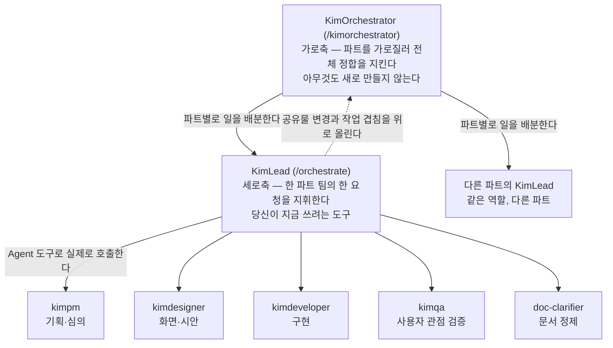
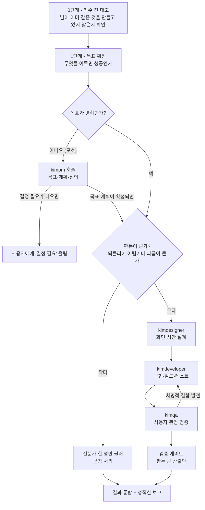
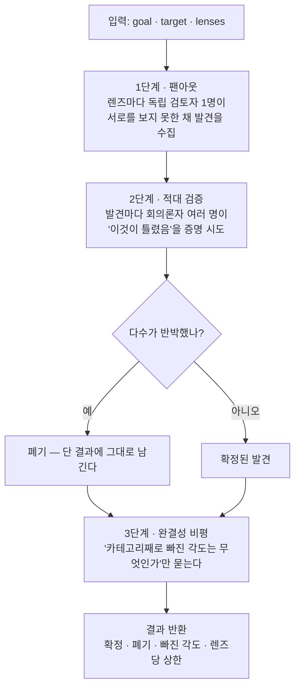

# KimLead(`/orchestrate`) 사용가이드 — 사람이 읽는 안내서

> **한 줄 요지:** `/orchestrate`는 큰 요청 하나를 던지면 **Kim 전문가들(기획·디자인·구현·검증·문서)을 실제로 불러 순서대로 일하게 만들고 결과를 하나로 통합해 돌려주는 지휘 도구**다. 여러 전문가를 엮어야 하는 일에만 쓰고, 한 줄이면 끝나는 일에는 쓰지 않는다.

이 문서는 **사람**을 위한 사용가이드다. `/orchestrate`가 실제로 읽고 따르는 지시문 정본은 `.claude/commands/orchestrate.md`에 있으며, 그 문서는 전부 에이전트에게 주는 2인칭 명령문("너는 ~한다")으로 되어 있다. 이 가이드는 그 지시문을 **"내가 이 도구를 언제 어떻게 쓰나"**라는 사용자의 질문 순서로 다시 정리한 것이다.

---

## 1. 이게 뭔가, 그리고 다른 Kim들과 무엇이 다른가

`/orchestrate`를 부르면 세션이 **KimLead**라는 역할을 맡는다. KimLead는 직접 만드는 사람이 아니라, 요청을 단계로 쪼개고 각 단계를 가장 잘하는 전문가에게 넘겨 순서대로 일하게 만드는 **팀 총괄 리드**다.

### 1-1. 결정적인 차이는 "실제로 부를 수 있다"는 점이다

이 팀에는 Kim이라는 이름이 붙은 전문가들이 여럿 있다. `kimpm`(기획), `kimdesigner`(디자인), `kimdeveloper`(구현), `kimqa`(검증)가 그들이다. 그들은 모두 **서브에이전트**로 등록되어 있다. 서브에이전트란 메인 세션이 별도로 띄워 일을 맡기는 보조 세션을 말하며, 한 가지 구조적 제약이 있다. **서브에이전트는 또 다른 서브에이전트를 띄우지 못한다.**

그래서 `kimpm`에게 큰 일을 맡기면, 그는 자기 분야를 끝낸 뒤 "이다음은 디자이너를 부르십시오"라는 **권고**만 남길 수 있다. 실제로 부르는 것은 사람의 몫으로 남는다.

`/orchestrate`는 여기가 다르다. 이것은 서브에이전트가 아니라 **슬래시 커맨드**다. 슬래시 커맨드는 세션에서 `/이름`으로 부르는 지시문 묶음이고, 불리면 **메인 세션 자신**이 그 역할을 맡는다. 메인 세션은 `Agent` 도구(서브에이전트를 실제로 띄우는 도구)를 쓸 수 있으므로, KimLead는 전문가들을 말로 권하는 데 그치지 않고 **실제로 호출해 일을 시킬 수 있다.**

**이것이 오케스트레이터를 서브에이전트가 아니라 커맨드로 만든 이유다.** 지휘하려면 부를 수 있어야 하고, 부를 수 있는 자리는 메인 세션뿐이기 때문이다.

### 1-2. 세 층의 역할 관계

이 시스템에는 세 종류의 역할이 있고 KimLead는 그중 가운데다. 아래 그림이 전체 관계다.



세 층의 차이를 말로 옮기면 이렇다.

| 역할 | 무엇을 하나 | 보는 범위 |
|---|---|---|
| **Kim 서브에이전트** (`kimpm`, `kimdesigner`, `kimdeveloper`, `kimqa`, `doc-clarifier`) | 실제로 만든다. 기획하고, 디자인하고, 구현하고, 검증하고, 문서를 다시 쓴다 | 자기 전문 분야 하나 |
| **KimLead** (`/orchestrate`) | 한 요청을 분해해 위 전문가들을 지휘해 만들게 한다. 세로축이다 | 하나의 작업, 하나의 파트 팀 |
| **KimOrchestrator** (`/kimorchestrator`) | 아무것도 만들지 않는다. 여러 파트를 가로질러 전체가 어긋나지 않게 지킨다. 가로축이다 | 모든 파트, 시간에 걸친 통합 |

여기서 놓치기 쉬운 사실이 하나 있다. **KimLead는 유일하지 않다.** 여러 파트 팀이 병렬로 일하고 각 팀에 각자의 KimLead가 있다고 전제되어 있으므로, 당신이 부른 KimLead가 보는 것은 자기 파트 하나뿐이다. 파트 사이의 접점(여러 팀이 함께 쓰는 데이터베이스 테이블, 공유 디자인 토큰, 공용 컴포넌트, 파트를 가로지르는 업무 흐름, 머지 순서)을 보는 자리는 KimOrchestrator다.

---

## 2. 언제 부르고, 언제 부르지 않나

**부를 때는 여러 전문가를 순서대로 엮어야 하는 큰 요청일 때다.** 예를 들어 "이런 화면을 새로 만들어 달라"는 요청은 기획으로 목표를 세우고, 디자인으로 시안을 잡고, 구현으로 코드를 쓰고, 검증으로 사용자 관점에서 깨보는 네 단계를 태우는 것이 자연스럽다. 이렇게 단계가 여러 개이고 앞 단계의 결과가 뒤 단계의 입력이 되는 일이 `/orchestrate`의 자리다.

**부르지 않을 때는 한 줄이면 끝나는 일이다.** 지시문 3절의 원칙 2는 이 점을 명시적으로 못 박아 두었다 — **"작은 일에 4단계 파이프라인을 다 붙이는 것은 그 자체가 실패다."** 오타 하나 고치기, 파일 하나 읽어 알려주기, 이미 시안이 있는 화면을 그대로 구현하기 같은 일에 지휘 체계를 얹으면 결과는 좋아지지 않고 시간과 토큰만 늘어난다.

판단이 애매할 때 쓸 수 있는 기준은 두 가지다. 첫째, **되돌리기 어려운가.** 되돌리기 쉬운 변경일수록 얕게 간다. 둘째, **파급이 큰가.** 다른 사람의 작업에 영향을 주는 변경일수록 깊게 간다. KimLead 자신도 이 두 기준으로 파이프라인의 깊이를 조절하도록 설계되어 있으므로, 작은 요청에 부르더라도 전 단계를 다 태우지는 않는다. 다만 애초에 작은 일이라면 전문가 하나를 직접 부르거나 그냥 요청하는 것이 더 빠르다.

---

## 3. 어떻게 부르나

세션에서 다음과 같이 입력한다.

```
/orchestrate <총괄해서 처리할 목표 또는 요청>
```

입력한 목표는 지시문 안의 `$ARGUMENTS` 자리에 그대로 꽂혀, KimLead가 "이번에 총괄할 요청"으로 읽는다. 예를 들어 다음과 같이 부른다.

```
/orchestrate 부품 상세 화면에 변경 이력 탭을 새로 만들어 달라
```

**목표는 구체적으로 적는 것이 좋지만, 완벽하게 정리해서 줄 필요는 없다.** 목표가 모호하면 KimLead는 전문가들을 돌리기 전에 `kimpm`을 불러 문제를 먼저 세우거나, 결과를 가르는 갈림길을 모아 당신에게 되묻도록 설계되어 있다. 지시문 3절 원칙 3의 표현을 그대로 옮기면, 문제가 덜 잡힌 채 전문가들을 돌리면 **"잘못 세운 문제에 정교한 답"**이 나오기 때문이다.

---

## 4. 부르면 무슨 일이 일어나나

### 4-1. 전체 흐름

KimLead는 다음 순서로 일한다. 앞으로만 가는 직선이 아니라, 뒤 단계에서 문제가 발견되면 앞 단계로 되돌아가는 구조라는 점이 중요하다.



각 단계를 풀어 쓰면 이렇다.

1. **착수 전 대조 (지시문 5-0절).** 전문가를 하나라도 부르기 전에, 원격 저장소를 최신으로 받고(`git fetch --all`) 열린 PR과 살아 있는 브랜치를 훑어 **같은 주제를 남이 이미 만들고 있지 않은지** 확인한다. 이 단계를 따로 둔 이유는 실제 사고에서 나왔다. 여러 세션이 서로를 볼 수 없어 같은 결함의 원인 분석을 독립적으로 세 번 했고, 한쪽이 만든 편집기 로직 410행이 다른 쪽이 91행으로 이미 푼 문제여서 대부분 버려졌다. 대조에서 가장 확실한 신호는 **파일 경로**다. 브랜치 이름이나 주제 이름은 흔들리지만 고칠 파일의 경로는 흔들리지 않기 때문이다.
2. **목표 확정.** 무엇을 이루면 성공인지 먼저 못 박는다. 모호하면 추측하지 않고 `kimpm`을 부르거나 당신에게 되묻는다.
3. **분해와 배정.** 요청을 단계로 쪼개고 각 단계에 적임 전문가를 붙인다. 쪼개는 방식에는 원칙이 하나 있다. **계층으로 쪼개지 않고 얇은 완결 단위로 쪼갠다.** "로직을 다 만들고, 그다음 화면을 붙이고, 마지막에 테스트를 쓴다"가 계층 분해이고, "작은 기능 하나를 화면 배선까지 끝내고 다음 기능으로 넘어간다"가 얇은 완결 단위 분해다. 후자를 택하는 이유는 **작업이 예고 없이 끊기기 때문**이다. 사용 한도 초과나 세션 종료로 중간에 멈추면, 계층 분해였을 때는 "로직은 있는데 화면이 없는" 미완결 상태가 저장소에 남아 당신은 아무것도 볼 수 없고 검증도 돌지 못한다. 얇은 완결 단위였다면 중단 지점이 곧 완결 지점이 된다.
4. **전문가 호출과 물림.** 각 전문가를 `Agent` 도구로 실제 호출한다. 이때 핵심은 **컨텍스트를 실어 주는 것**이다. 서브에이전트는 서로의 대화를 보지 못하므로, 디자이너가 만든 시안을 개발자 호출에, 개발자가 만든 화면을 검증 호출에 명시적으로 실어 주어야 사슬이 끊기지 않는다. 지시문은 이 물림을 "곧 오케스트레이션"이라고 부른다.
5. **검증 게이트 (지시문 7절).** 판돈이 큰 산출은 다음 단계로 넘기기 전에 독립된 눈으로 공격해 본다. 산출을 만들지 않은 검증자를 띄워 "이것이 틀렸음을 증명해 보라"고 시키는 적대 검증, 검증자마다 서로 다른 렌즈를 주는 관점 패널, 최종 보고 직전에 "카테고리째로 빠진 각도는 무엇인가"만 묻는 완결성 비평가가 그 방법이다. 사소한 산출에 검증자를 셋 붙이는 것 자체가 실패로 규정되어 있으므로, 이 게이트는 되돌리기 어려운 산출에만 열린다.
6. **통합과 보고.** 전문가들의 결과를 이어 붙이는 것이 아니라, 목표에 비춰 하나의 이야기로 엮어 보고한다(5절 참조).

### 4-2. 팀 명부 — 누가 무엇을 하나

KimLead가 부를 수 있는 전문가는 다섯 명으로 정해져 있다. 없는 전문가를 지어내는 것은 금지되어 있고, 필요가 있으면 보고에 적어 당신이 판단하게 한다.

| 전문가 | 언제 넘기나 | 무엇을 돌려받나 |
|---|---|---|
| `kimpm` (시니어 PM) | 방향이 열린 기획과 의사결정, 여러 갈래를 심의해야 할 때, 요청 자체가 모호해 문제부터 세워야 할 때 | 목표와 계획, 심의 결과, 그리고 사용자가 답해야 하는 "결정 필요" 항목 |
| `kimdesigner` (시니어 디자이너) | 새 UI 설계, 기존 화면 리디자인, 디자인 리뷰, 시안 완성도 끌어올리기 | 실제로 렌더해 눈으로 확인까지 마친 디자인 산출(시안, 토큰, 근거) |
| `kimdeveloper` (시니어 개발자) | 기능 구현, 시안의 실코드화, 버그 수정, 리팩터 | 동작이 확인된 코드와 보고. 사용자가 화면에서 그것에 닿을 수 있다는 증명("보는 법")이 함께 오거나, 아직 연결하지 않았다면 "미배선"이라는 명시가 함께 온다 |
| `kimqa` (시니어 QA) | 다 만든 기능이나 화면을 출시 전에 사용자 관점에서 검증할 때 | 도달성 판정(정상 진입점에서 실제로 닿는가)과 페르소나 렌즈 검증 결과, 발견된 막힘과 엣지 케이스. **단 7-1절의 축소 모드 주의사항을 함께 읽어라** |
| `doc-clarifier` (문서 정제) | 안 읽히는 기존 마크다운 문서를 한 번에 읽히게 다시 쓸 때 | 다시 쓴 문서의 파일 경로와 변경 요약. **아티팩트 게시는 오지 않는다(7-2절)** |

여기서 사용자가 알아 두면 이득인 관문이 하나 있다. **KimLead는 노출 증명이 없는 개발 보고를 완료로 수납하지 않는다.** 노출 증명이란 팀 규칙(`.claude/rules/communication.md` 규칙 7-2)에 정의된 개념으로, "산출물이 존재한다"가 아니라 **"사용자가 정상 경로로 그것에 닿을 수 있고 실제 환경에서 동작한다"**를 증명해야 완료라는 기준이다. 개발 보고에 그 증명이 없으면 KimLead는 무엇이 빠졌는지 구체적으로 지정해 개발 단계로 되돌린다. 진입점 등록이 없는지, "보는 법" 세 줄이 없는지, 데이터베이스 변경의 적용 상태가 비어 있는지를 짚는 방식이다.

되돌리지 않는 예외는 하나뿐이다. 개발자가 **"미배선 — 후속 작업에서 연결"**을 명시적으로 적었을 때다. 단계를 나눠 엔진을 먼저 만드는 것은 정당한 전략이므로 막지 않는다. 다만 그때는 그 미배선 상태가 당신에게 오는 최종 보고에도 그대로 실려야 한다.

### 4-3. 되돌림에는 상한이 있다

검증에서 결함이 나오면 개발로 되돌아가지만, 그 루프는 무한하지 않다. 규칙은 이렇게 정해져 있다.

- **같은 결함으로 두 번 되돌린 뒤에도 해결되지 않으면, 세 번째 되돌림 대신 그 결함을 "결정 필요"로 당신에게 올린다.** 두 번 실패했다는 것은 구현이 부족한 것이 아니라 요구나 설계가 갈리는 지점이라는 신호로 해석하기 때문이다.
- **되돌린 횟수는 보고에 남는다.** "검증에서 개발로 두 번 되돌렸고 두 번째에 해결됐다"는 문장은 그 산출의 신뢰도를 알려 주는 정보이므로 지우지 않는다.
- **서로 다른 결함이면 상한을 새로 센다.** 상한은 같은 결함에만 적용된다. 새 결함이 계속 나오는 것은 검증이 제대로 돌고 있다는 뜻이다.

---

## 5. 무엇이 돌아오나

KimLead의 최종 보고는 아래 골격을 기본으로 한다. 요청의 성격에 따라 소제목이 조정되지만, 각 칸이 왜 있는지를 알면 보고를 훨씬 빨리 읽을 수 있다.

| 보고의 칸 | 여기 들어가는 것 | 이 칸이 왜 있나 |
|---|---|---|
| `## 결과` | 무엇을 총괄해 무엇이 나왔는지 | 결론을 맨 앞에 둔다. 바쁘면 이 칸만 읽어도 핵심이 전달되어야 한다 |
| `## 보는 법` | 어디서, 무엇을 하면, 무엇이 보이나 — 세 줄 | 화면 산출이 있으면 필수다. 이 세 줄을 쓰려는 순간 배선이 없으면 쓸 내용이 없어, 보고가 나가기 전에 누락이 스스로 드러난다 |
| `## 어떻게 지휘했나` | 어떤 전문가를 어떤 순서로 왜 불렀는지, 단계별 산출 요약 | 결과만 보면 그것이 어떤 검증을 거쳐 나왔는지 알 수 없다 |
| `## 확인한 것 / 확인하지 못한 것` | 이 보고를 어디까지 믿을 수 있는가 | 아래에서 따로 설명한다 |
| `## 결정 필요` | 사용자가 답해야 진행되는 갈림길 | 결과를 가르는 판단은 KimLead가 정하지 않는다. 각 항목에 권고안이 붙어 있어 짧게 답하면 곧장 다음 지휘로 이어진다 |
| `## 남은 것 (요청 범위 안)` | 이 요청을 끝내기 위해 남은 일만 | 아래에서 따로 설명한다 |
| `## 참고 — 함께 발견한 것` | 작업 중 눈에 들어왔지만 요청 밖인 것 | 아래에서 따로 설명한다 |

### 5-1. "확인하지 못한 것"과 "남은 것"은 다르다

이 두 칸을 혼동하면 보고를 잘못 읽는다. 차이는 **시점**이다.

- **"확인하지 못한 것"은 이미 한 일의 한계다.** 예를 들어 "이 화면은 로컬에서 띄워 눈으로 봤지만 특정 모달은 데이터가 없어 열어 보지 못했다"는 문장이 여기 들어간다. 이것은 앞으로 할 일이 아니라 **지금 이 보고의 신뢰 범위**를 알려 주는 정보다.
- **"남은 것"은 앞으로 할 일이다.** PR을 여는 것, 리뷰를 받는 것, 실제 환경에 적용해 확인하는 것처럼 이 작업을 끝내는 데 필요한 단계가 여기 들어간다.

칸을 갈라 두지 않으면 첫 번째 종류의 문장이 두 번째에 섞여 약해지거나 아예 빠진다. 하위 전문가들도 이 칸을 각자 갖고 있어서, `kimqa`는 확인한 것과 확인 못 한 것을 2차원 장부로 남기고 `kimdeveloper`도 실행으로 확인한 것과 못 한 것을 구분해 보고한다. KimLead의 몫은 그것들이 최종 보고까지 살아 올라오게 하는 것이다.

### 5-2. "남은 것"과 "참고 — 함께 발견한 것"을 갈라 두는 이유

큰 작업을 하면 요청받지 않은 문제가 반드시 눈에 들어온다. 그것을 "다음에 할 일"처럼 한 목록에 적으면 무슨 일이 벌어지는지 팀 규칙은 이렇게 짚는다 — **범위를 정하는 권한이 사용자에게서 보고하는 쪽으로 조용히 넘어간다.** 읽는 사람은 자기가 승인하지 않은 목록을 이미 승인된 계획으로 읽게 되고, 매번 "이건 내가 시킨 게 아닌데"를 되짚어 걸러내야 한다.

그래서 `## 참고 — 함께 발견한 것`에 적힌 항목에는 **"지시가 없으면 착수하지 않는다"**는 문장이 함께 붙는다. 발견을 숨기는 것도 정직하지 않으므로 적기는 하되, 자리를 분명히 갈라 계획으로 오해되지 않게 한 것이다.

### 5-3. 보고 끝에 상태가 붙는다

보고 마지막에는 팀 규칙 7의 세 단계 어휘 중 하나가 명시된다.

| 상태 | 뜻 |
|---|---|
| **작업완료** | 산출물을 만들고 검증한 뒤 작업 브랜치에 커밋과 푸시까지 마친 상태. Claude가 자기 손으로 도달할 수 있는 마지막 지점이다 |
| **검토대기** | PR(브랜치를 main에 합쳐 달라는 요청)이 열려 사람의 리뷰와 승인을 기다리는 상태 |
| **배포완료** | main에 머지되고 실제 환경에서 노출까지 확인된 상태. 꾸밈없는 "완료"라는 말은 이 상태에만 쓴다 |

여러 산출물을 함께 만들었을 때는 **장치마다 증명 상태를 갈라 적는 것**이 규칙이다. 문서 하나와 자동 검사 하나를 함께 만들었다면 "반영됐다"로 뭉치지 않고, "이 검사는 실제로 한 번 돌려 결함 몇 건을 잡았다"와 "이 문서는 아직 발동한 적이 없다"를 따로 적는다. 뭉치면 실제로 검증된 것과 글로만 있는 것이 같은 문장에 들어가 읽는 사람이 구분할 방법이 없어지기 때문이다.

---

## 6. KimLead가 하지 않는 것 — 사람이 해야 하는 것

**이 절이 이 가이드에서 가장 중요하다.** KimLead에게 맡길 수 없는 일을 알고 있어야, 보고를 받은 뒤 무엇을 해야 하는지 알 수 있다.

### 6-1. 결과를 가르는 갈림길은 KimLead가 정하지 않는다

전문가들은 "호출자가 정해야 진행되는 갈림길"을 발견하면 반환에 `## 결정 필요`라는 소제목으로 올리도록 규약이 통일되어 있다. KimLead는 그 항목들을 임의로 정하지 않고 모아서 당신에게 올린다. 각 항목에는 권고안이나 기본값이 달려 있어, 당신이 짧게 답하면 KimLead가 그 답을 실어 다음 전문가를 이어서 호출한다. 앞 단계를 처음부터 다시 시키지 않는다.

따라서 **보고에 `## 결정 필요`가 있으면 그 작업은 당신의 답을 기다리는 상태다.** 그 절을 지나치면 작업은 그 자리에서 멈춰 있다.

### 6-2. 작업이 겹쳐도 "누가 멈추나"는 KimLead가 정하지 못한다

착수 전 대조에서 다른 브랜치와의 겹침이 발견되었을 때, KimLead에게는 그것을 **발견할 능력은 있지만 판정할 권한이 없다.** 자기 작업이 중복이라고 판단해 스스로 멈추면 당신의 요청을 이행하지 않은 것이 되고, 그냥 진행하면 중복이 그대로 만들어진다. 그래서 규칙은 이렇게 되어 있다.

- **구현을 시작하기 전에** 어느 브랜치가 어떤 파일을 이미 만졌는지 구체적으로 적어 당신에게 올린다. 선택지는 대개 셋이다. 그쪽 작업을 이어받을 것인가, 그쪽이 끝날 때까지 기다릴 것인가, 범위를 갈라 나눠 할 것인가.
- **작은 겹침이면 멈추지 않고 알린 뒤 진행한다.** 파일 한 줄이 겹치는 것까지 결정 사항으로 올리면 아무것도 진행되지 않기 때문이다.

이 대조 단계의 한계도 알아 두는 것이 좋다. **이것은 문서형 장치다.** KimLead가 그 절을 읽고 수행해야 작동한다. 저장소에 푸시 시점의 브랜치 겹침 알림 워크플로가 함께 있으면 기계적으로 한 번 더 잡아 주지만, 그 장치가 없는 저장소에서는 이 절이 유일한 방어선이다.

### 6-3. 공유물을 바꾸는 변경은 승인 대상으로 올라온다

이 시스템에는 **계약(contract)**이라는 개념이 있다. 여러 파트가 함께 쓰는 것들을 말하며, 대체로 다음 넷이다.

1. 여러 파트가 함께 읽고 쓰는 데이터베이스 테이블과 그 컬럼
2. 디자인 토큰 — 색, 간격, 타이포처럼 모든 화면이 공유하는 시각 규칙의 정본
3. 공용 컴포넌트 — 두 개 이상의 파트 화면이 함께 쓰는 UI 조각
4. 파트를 가로지르는 업무 흐름 — 한 파트에서 일어난 일이 다른 파트의 화면을 함께 바꾸는 연쇄

**파트 내부만 바뀌는 변경은 팀 재량이라 KimLead가 그냥 진행한다. 그러나 계약을 바꾸는 변경은 승인 대상이다.** KimLead는 그 사실을 `## 결정 필요`에 "계약 변경 — KimOrchestrator 경유 승인 필요"로 올린다. 판단이 애매하면 올리는 쪽을 택하도록 되어 있는데, 잘못 올리는 비용은 확인 한 번이고 안 올리는 비용은 다른 팀의 화면이 조용히 깨지는 것이기 때문이다.

### 6-4. 머지는 KimLead 단독으로 하지 않는다

**KimLead의 자리는 PR을 열고 상태를 "검토대기"로 보고하는 데까지다.** 머지 자체는 그의 단독 판단으로 하지 않는다.

이유를 알아야 이 규칙이 지켜진다. 여러 파트가 병렬로 일하면, 오래된 base(브랜치를 딴 시점의 main)에서 만든 브랜치를 최신화 없이 머지할 때 **다른 팀이 방금 넣은 최신 작업이 조용히 되돌아가는 사고**가 생긴다. 내 변경 자체는 정상인데 합치는 순간 남의 것이 사라지는 형태이고, 각 팀이 자기 PR만 봐서는 절대 보이지 않는다.

그래서 머지는 `/merge-gate`라는 별도 커맨드를 거친다. 최신화 확인, PR 게이트 재실행, 계약 충돌 교차 탐지, 되돌림 사전 시뮬레이션을 거친 뒤 하나씩 직렬로 머지하는 장치이며, KimOrchestrator가 부린다. KimLead는 머지가 필요하다는 사실과 여러 PR을 동시에 열었다는 사실을 보고에 적어 올리고, 직렬 머지 순서를 정하는 판단은 가로축에 맡긴다.

### 6-5. 그 밖에 KimLead가 하지 않는 것

- **요청 범위를 임의로 넓히지 않는다.** 요청과 무관한 코드나 문서는 손대지 않고 제안만 한다.
- **자기 파트 밖을 직접 고치러 가지 않는다.** 다른 파트에도 같은 문제가 보이면 보고에 적어 가로축이 퍼뜨리게 한다.
- **되돌리기 어렵거나 바깥으로 나가는 행동**(커밋, 푸시, PR, 외부 전송, 삭제)은 지시가 명확하지 않으면 먼저 확인한다.
- **없는 전문가를 지어내지 않는다.** 필요가 있으면 보고에 적어 사람이 판단하게 한다.

---

## 7. 알아 두면 손해를 막는 함정 세 개

아래 셋은 지시문 안에 흩어져 있어 사람이 찾기 어렵지만, 모르면 결과를 잘못 해석하게 되는 것들이다.

### 7-1. `kimqa`는 서브에이전트로 불리면 축소 모드로 돈다 — 그리고 판돈이 클 때 배선 검사가 빠질 수 있다

`kimqa`의 검증 엔진은 `qa-swarm`이라는 스킬이다. 이 스킬은 원래 여러 **페르소나**(정보 없는 첫 사용자, 작정하고 부수는 전문가 같은 가상의 이해관계자)를 **서브에이전트로 띄워** 동시에 앱을 써 보게 하는 스웜이다.

그런데 KimLead가 `kimqa`를 서브에이전트로 부르면, `kimqa`는 또 다른 서브에이전트를 띄우지 못한다. 그래서 스웜을 띄우는 대신 **페르소나 렌즈를 혼자 순서대로 갈아 끼우는 축소 실행**이 된다. 가벼운 검증에는 충분하지만, 판돈이 정말 큰 검증이라면 KimLead가 `kimqa`에게 위임하지 말고 **메인 세션에서 `qa-swarm`을 직접 지휘**해야 진짜 다중 에이전트 스웜이 돈다.

**여기에 반드시 알아야 할 역전이 하나 있다.** 배선 누락(만들어졌으나 사용자가 닿을 수 없는 상태)을 잡는 장치는 **0번 관문(도달성 검사)** 하나뿐이다. 이 관문은 호출자가 알려 준 화면 경로를 쓰지 않고 제품의 정상 진입점(첫 화면과 네비게이션 메뉴)에서 출발해 검증 대상까지 스스로 도달을 시도하는 검사다. 그런데 **이 관문은 `.claude/agents/kimqa.md` 문서에만 정의되어 있다.** 따라서 `kimqa`를 건너뛰고 `qa-swarm`을 직접 돌리면 관문이 함께 사라지고, 결과가 뒤집힌다 — **판돈이 작을 때는 배선 검사가 돌고, 판돈이 클 때 빠진다.**

그래서 지시문은 직접 지휘하는 경우 스웜을 돌리기 전에 KimLead가 먼저 정상 진입점에서 도달을 시도하고 그 결과를 보고에 남기도록 규정한다. **사용자 입장에서 확인할 것은 하나다.** 판돈이 큰 검증 보고를 받았을 때 `## 도달성` 또는 그에 해당하는 판정이 보고에 있는지 본다. 없으면 배선 검사가 빠진 보고일 수 있다.

### 7-2. `doc-clarifier`는 아티팩트를 못 띄운다

`doc-clarifier`도 서브에이전트이므로 **아티팩트**(사용자가 클릭 한 번으로 열어 보는 산출물 화면)를 띄우지 못한다. 돌려주는 것은 고쳐 쓴 파일의 경로와 변경 요약뿐이다.

팀 규칙 6은 사용자가 지금 검토해야 하는 문서를 파일 경로만 알려 주고 끝내지 말고 아티팩트로 띄우라고 정하고 있으므로, **그 게시는 KimLead가 이어서 직접 해야 한다.** `doc-clarifier`가 이미 띄웠다고 믿고 건너뛰면 당신은 링크를 끝내 받지 못한다. 문서 정제를 맡긴 뒤 경로만 오고 볼 수 있는 링크가 없다면, 이 단계가 빠진 것이다.

### 7-3. 개발에서 검증으로 넘길 때 화면 경로를 일부러 주지 않는다

이것은 실수가 아니라 의도된 설계다. KimLead는 앱을 띄우는 방법(구동 명령, 테스트 계정, 환경 설정)은 `kimqa`에게 실어 주지만, **새 기능이 화면 어디에 있는지(메뉴 경로나 주소)는 주지 않는다.**

이유는 이렇다. 검증자가 "이 주소로 들어가면 됩니다"라는 안내를 받으면 그대로 들어가서 기능만 확인하고, **네비게이션에 진입점이 아예 없다는 사실은 끝까지 발견하지 못한다.** 실제 사용자는 그 안내를 받지 못하므로, 검증자도 받지 않아야 사용자와 같은 조건에 선다.

개발이 보고한 "보는 법"은 KimLead가 들고 있다가 **검증자가 스스로 찾아낸 경로와 대조하는 데만** 쓴다. 둘이 다르거나 검증자가 경로를 찾지 못했다면, 그것이 곧 배선 결함이다.

---

## 8. 판돈이 정말 클 때 — `kimlead-verified` 워크플로

검증할 대상이 목록 형태이고(결함 열 건, 화면 여덟 개, 문서 다섯 편) 흐름이 정형이라면, KimLead가 매 단계를 즉흥으로 지휘하는 대신 **`Workflow` 도구로 `.claude/workflows/kimlead-verified.js`를 돌린다.** 흐름이 코드로 고정되어 있어 몇 번을 돌려도 같은 구조로 재현되고, 결과가 산문이 아니라 스키마로 검증된 데이터로 돌아온다는 것이 이 방식의 장점이다.

### 8-1. 무엇을 넣나

입력은 모두 `args`로 넘긴다.

| 입력 | 필수 여부 | 뜻 |
|---|---|---|
| `goal` | 필수 | 이 검토로 무엇을 확인하려는가 — 한 문장 |
| `target` | 필수 | 검토 대상. 파일 경로를 주면 각 에이전트가 직접 읽는다 |
| `lenses` | 선택 | 검토 관점의 목록. 렌즈 하나마다 독립 검토자 한 명이 붙는다. 비우면 아래 기본 넷이 쓰인다 |
| `refuters` | 선택 (기본 3) | 발견 하나마다 붙는 회의론자 수. 다수가 반박하면 그 발견은 폐기된다 |
| `maxFindingsPerLens` | 선택 (기본 4) | 렌즈당 최대 발견 수 |

`goal`이나 `target`이 없으면 워크플로는 시작하지 않고 오류를 낸다.

### 8-2. 어떻게 도나



세 단계를 말로 풀면 이렇다.

1. **팬아웃.** 렌즈마다 독립 검토자 한 명을 띄운다. 검토자들은 서로의 결과를 보지 못하고 자기 렌즈 하나로만 대상을 본다. 추측이 아니라 대상에서 직접 확인한 것만 적도록 지시받는다.
2. **적대 검증.** 발견 하나마다 회의론자를 여럿 띄워 그 발견이 틀렸음을 증명하게 한다. 회의론자의 **기본값은 "틀렸다"**이고, 대상을 직접 확인해 발견이 실제로 성립함을 봤을 때만 통과시킨다. 다수가 반박한 발견은 폐기된다. 검증자가 모두 응답하지 못한 경우에도 보수적으로 폐기한다.
3. **완결성 비평.** 마지막에 비평가 한 명을 띄워 딱 하나만 묻는다 — 이 검토에서 카테고리째로 빠진 각도는 무엇인가. 돌지 않은 렌즈, 검증되지 않은 전제, 읽지 않은 관련 자료가 그 대상이며 최대 세 건까지 나온다.

**결과에는 폐기된 발견과 렌즈당 상한도 함께 남는다.** 이것은 "침묵의 상한 금지"라는 원칙 때문이다. 상위 몇 건만 봤거나 일부만 샘플링했는데 조용히 자르면, 읽는 사람은 "다 커버했다"로 오해한다.

### 8-3. 기본 렌즈 넷 — 네 번째가 왜 따로 있나

`lenses`를 비우면 다음 넷이 쓰인다.

1. **정확성** — 사실과 다르거나 그대로 실행하면 깨지는 서술
2. **완결성** — 통째로 빠진 단계, 조건, 예외 처리
3. **일관성** — 저장소의 기존 규칙과 규약, 다른 문서와 충돌하는 부분
4. **도달 가능성** — 사용자가 제품의 정상 진입점에서 이 산출에 실제로 닿을 수 있는가. 만들어 놓고 아무 곳에서도 부르지 않는 요소가 없는가. 파일로만 있고 실제 환경에 적용되지 않은 변경이 없는가

네 번째를 따로 둔 이유는 코드의 주석에까지 적혀 있다. **앞의 셋은 산출물 "안"을 보는데, 이 렌즈만 산출물 "바깥"의 연결을 본다.** 완결성 렌즈는 "이 문서에 빠진 절이 있나"를 묻고, 도달 가능성 렌즈는 "이 문서를 아무도 링크하지 않는 것은 아닌가"를 묻는다. 배선 누락을 잡는 것은 후자뿐이므로 완결성에 합칠 수 없다.

### 8-4. 토큰 비용을 숫자로 알아 둔다

이 워크플로는 에이전트를 수십 개 띄운다. 기본값으로 돌렸을 때의 상한을 계산하면 이렇다.

| 단계 | 에이전트 수 | 계산 |
|---|---|---|
| 팬아웃 | 4 | 기본 렌즈 4개 × 검토자 1명 |
| 적대 검증 | 최대 48 | 발견 최대 16건(렌즈 4개 × 렌즈당 상한 4건) × 회의론자 3명 |
| 완결성 비평 | 1 | 비평가 1명 |
| **합계** | **최대 53** | |

이것이 지시문과 워크플로 설명이 모두 **"판돈이 정말 클 때만"**이라고 못 박아 둔 이유다. 사소한 확인에 꺼내는 도구가 아니다. 비용을 줄이려면 `lenses`를 줄이거나 `refuters`와 `maxFindingsPerLens`를 낮춰 넘긴다.

---

## 9. 어디를 고치면 되나

KimLead의 동작을 바꾸고 싶으면 아래 두 파일을 고친다. 이 저장소(창고)가 단일 원본이고, 파생 저장소들은 동기화 봇이 가져간다.

| 무엇을 바꾸려면 | 고치는 파일 |
|---|---|
| KimLead가 일하는 방식 전부 — 팀 명부, 파이프라인, 인수 기준, 보고 골격, 금지 사항 | `.claude/commands/orchestrate.md` (지시문 정본) |
| 결정론적 검증 워크플로 — 기본 렌즈, 회의론자 수, 발견 상한, 반환 스키마 | `.claude/workflows/kimlead-verified.js` |
| 이 사용가이드 자체 | `docs/system-layer/kimlead-guide.md` (지금 읽고 있는 문서) |

동기화 봇(`.github/workflows/sync-skills.yml`)은 `.claude/skills/`와 `.claude/rules/`, `.claude/agents/`, `.claude/commands/`, `.claude/workflows/`를 파생 저장소로 내려보낸다. 따라서 `.claude/` 아래를 고치면 각 저장소가 다음 동기화에서 따라온다. 반면 `docs/` 아래의 문서는 동기화 대상이 아니라 이 창고에만 남는다.

관련 문서로는 다음이 있다.

- **`.claude/rules/communication.md`** — 보고의 어투와 완료 어휘, 노출 증명의 정본. KimLead의 보고 규격은 전부 이 규칙에서 나온다.
- **`.claude/agents/kimqa.md`** — 0번 관문(도달성 검사)의 정본. 7-1절에서 설명한 관문의 정확한 정의가 여기 있다.
- **`.claude/commands/kimorchestrator.md`** — 가로축의 지시문. KimLead가 무엇을 위로 올리고 무엇을 받는지의 반대편이다.
- **`.claude/commands/merge-gate.md`** — 머지 게이트의 지시문. 6-4절에서 설명한 장치다.
