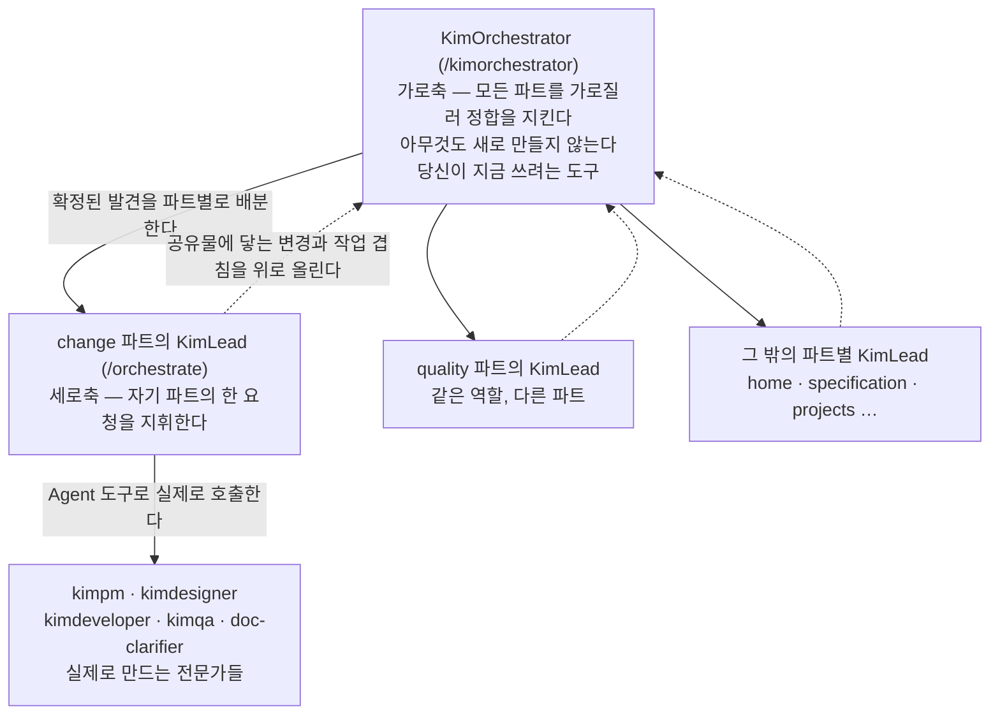
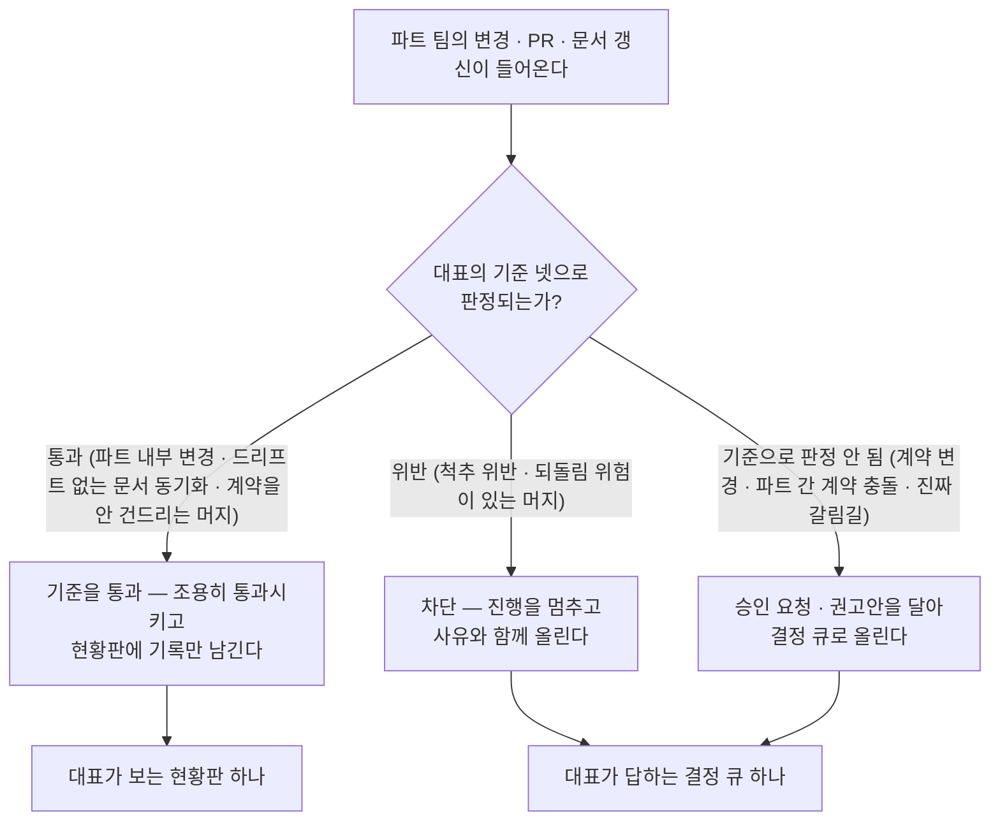
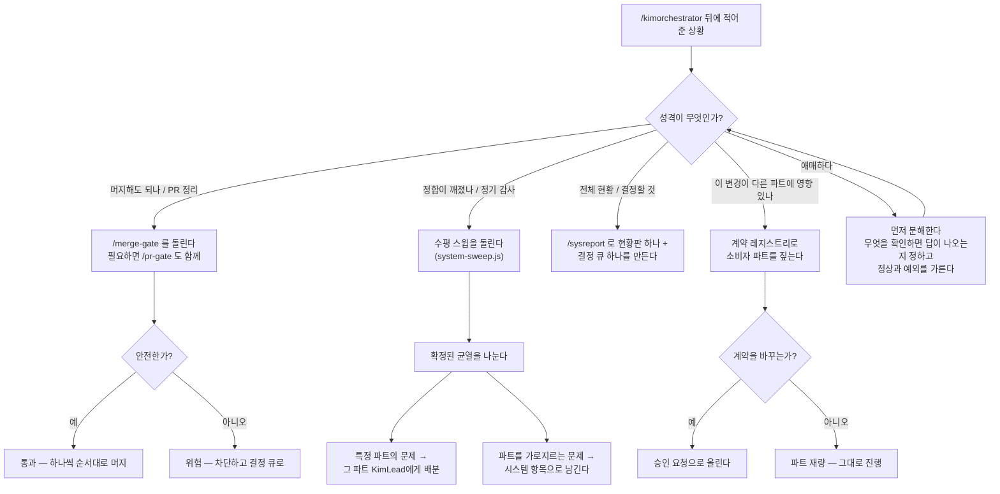

# KimOrchestrator(`/kimorchestrator`) 사용가이드 — 사람이 읽는 안내서

> **한 줄 요지:** `/kimorchestrator`는 여러 팀이 병렬로 일하는 저장소에서 **파트를 가로지르는 정합(整合)을 대신 지켜 주는 도구**다. 새로 만드는 일은 전혀 하지 않는다. 기준을 통과하는 것은 조용히 통과시키고, 사람이 반드시 판단해야 하는 **예외와 갈림길만** 골라 올린다. 그래서 이것을 부르는 사람이 최종적으로 보는 것은 현황판 하나와 결정 큐 하나다.

이 문서는 **사람**을 위한 사용가이드다. `/kimorchestrator`가 실제로 읽고 따르는 지시문 정본은 `.claude/commands/kimorchestrator.md`에 있고, 그 문서는 전부 에이전트에게 주는 2인칭 명령문("너는 ~한다")으로 되어 있다. 이 가이드는 그 지시문을 **"내가 이 도구를 언제 어떻게 쓰나"**라는 사용자의 질문 순서로 다시 정리한 것이다.

같은 시스템의 세로축 도구에 대한 안내는 [`docs/system-layer/kimlead-guide.md`](./kimlead-guide.md)에 따로 있다. 두 문서는 짝이며, 이 가이드의 9절이 둘이 맞물리는 지점을 다룬다.

---

## 1. 이게 뭔가

`/kimorchestrator`를 부르면 세션이 **KimOrchestrator**라는 역할을 맡는다. 지시문이 스스로를 부르는 이름은 **"대표의 통합 분신"**이다. 이 표현에 이 도구의 성격이 다 들어 있으므로 두 조각으로 나눠 풀어 둔다.

**"통합"이라는 조각.** 파트별 팀들이 각자 자기 파트를 병렬로 만드는 상황을 전제한다. 각 팀은 자기 파트를 잘 만들 수 있지만, 파트와 파트가 만나는 지점 — 여러 팀이 함께 쓰는 데이터베이스 테이블, 모두가 공유하는 디자인 토큰, 한 파트에서 일어난 일이 다른 파트 화면을 함께 바꾸는 흐름, 여러 브랜치를 main에 합치는 순서 — 은 어느 팀의 시야에도 들어오지 않는다. KimOrchestrator는 정확히 그 지점만 본다.

**"대표의 분신"이라는 조각.** 위와 같은 통합 판단은 원래 대표(팀을 총괄하는 사람) 한 명이 혼자 감당하던 자리다. KimOrchestrator는 그 부담을 나눠 지도록 만들어졌다. 대표의 판단 기준을 몸에 지니고 있어서, 그 기준으로 판정이 되는 것은 대표를 거치지 않고 처리하고, 기준으로 판정되지 않는 것만 올린다. 무엇이 기준이고 무엇이 올라가는지는 5절이 전부다.

여기서 가장 자주 오해되는 점을 먼저 못 박는다. **KimOrchestrator는 아무것도 만들지 않는다.** 화면도, 코드도, 기능도 만들지 않는다. 그것은 KimLead와 Kim 전문가들의 일이고, KimOrchestrator가 직접 구현에 손을 대기 시작하면 지시문 6절이 그것을 **역할 이탈**로 규정한다. 이 도구에게 "이 기능 만들어 줘"라고 부탁하는 것은 잘못된 사용이다.

---

## 2. 다른 Kim들과 무엇이 다른가 — 세 층의 역할

이 시스템에는 세 종류의 역할이 있고, KimOrchestrator는 그중 **가장 위, 시스템 전체를 보는 자리**다. 셋을 구별하지 못하면 매번 잘못된 도구를 부르게 되므로 그림과 표로 함께 정리한다.



세 층의 차이를 말로 옮기면 이렇다.

| 역할 | 무엇을 하나 | 축 | 보는 범위 |
|---|---|---|---|
| **Kim 서브에이전트** (`kimpm`, `kimdesigner`, `kimdeveloper`, `kimqa`, `doc-clarifier`) | 실제로 만든다. 기획하고, 디자인하고, 구현하고, 검증하고, 문서를 다시 쓴다 | — | 자기 전문 분야 하나 |
| **KimLead** (`/orchestrate`) | 한 요청을 단계로 분해해 위 전문가들을 지휘해 만들게 한다 | 세로 | 하나의 작업, 하나의 파트 팀 |
| **KimOrchestrator** (`/kimorchestrator`) | 아무것도 만들지 않는다. 파트들을 가로질러 전체가 어긋나지 않게 지킨다 | 가로 | 모든 파트, 시간에 걸친 통합 |

**여기서 결정적인 사실은 KimLead가 유일하지 않다는 점이다.** 파트 팀이 여럿이면 KimLead도 여럿이고, 각 KimLead가 보는 것은 자기 파트 하나뿐이다. 그러므로 파트 사이의 접점 — 같은 테이블, 같은 디자인 토큰, 같은 흐름, 머지 순서 — 을 보는 자리는 **KimOrchestrator 하나뿐**이다. 이 하나가 없으면 각 팀의 PR은 모두 정상인데 합쳐 놓은 결과만 깨지는 상황이 생기고, 그 결과는 아무도 자기 PR을 보면서 발견할 수 없다.

### 2-1. 왜 서브에이전트가 아니라 커맨드인가

KimOrchestrator는 **슬래시 커맨드**다. 슬래시 커맨드란 세션에서 `/이름`으로 부르는 지시문 묶음이고, 불리면 **메인 세션 자신**이 그 역할을 맡는다. 반대로 서브에이전트는 메인 세션이 별도로 띄우는 보조 세션인데, 서브에이전트에는 구조적 제약이 하나 있다 — **또 다른 서브에이전트를 띄우지 못한다.**

이 차이가 실제 능력을 가른다. 메인 세션은 `Agent` 도구(서브에이전트를 실제로 띄우는 도구)와 `Workflow` 도구(정해진 흐름을 코드로 돌리는 도구)를 쓸 수 있다. 그래서 KimOrchestrator는 6절의 장치들을 **말로 권하는 데 그치지 않고 실제로 실행한다.** 지휘하고 게이트를 돌리는 역할을 에이전트가 아니라 커맨드로 만든 이유가 이것이다.

---

## 3. 언제 부르나

지시문의 `argument-hint`에 실제 호출 예시가 세 개 적혀 있다. 그것을 그대로 옮기면 이렇다.

- "지금 열린 PR들 머지해도 되나 봐줘"
- "시스템 정합 스윕 돌려줘"
- "전체 현황 올려줘"

이 셋이 대표적인 자리이고, 지시문 4절은 들어온 상황을 네 가지 성격으로 갈라 각각 다른 장치를 엮도록 정해 두었다. 사용자 입장에서는 아래 표에서 자기 상황을 골라 그 문장대로 부르면 된다.

| 지금 당신의 상황 | 이렇게 부른다 | KimOrchestrator가 하는 일 |
|---|---|---|
| 브랜치를 main에 합쳐도 되는지 모르겠다. PR이 여러 개 열려 있다 | "지금 열린 PR들 머지해도 되나 봐줘" | 머지 게이트를 돌려 최신화 여부와 계약 충돌, 되돌림 위험을 확인한다. 안전하면 통과시켜 하나씩 순서대로 머지하고, 위험하면 결정 큐로 올린다 |
| 여러 파트의 변경이 쌓였다. 전체가 아직 맞물려 있는지 확인하고 싶다 | "시스템 정합 스윕 돌려줘" | 수평 스윕을 돌려 확정된 균열을 받고, 특정 파트의 문제는 그 파트 KimLead에게 배분하고, 파트를 가로지르는 것은 시스템 항목으로 남긴다 |
| 지금 전체가 어떤 상태인지, 내가 답해야 할 것이 무엇인지 알고 싶다 | "전체 현황 올려줘" | 파트별 보고를 모아 현황판 하나와 결정 큐 하나로 종합해 올린다 |
| 내가 하려는 이 변경이 다른 파트에 영향을 주는지 모르겠다 | "이 변경이 다른 파트에 영향 있나 봐줘" | 계약 레지스트리로 그 공유물의 소비자 파트를 짚고, 계약을 바꾸는 변경이면 승인 요청으로 올린다 |

**어느 쪽인지 애매하면 그대로 애매하게 불러도 된다.** 지시문 4절의 마지막 항목은 성격이 애매할 때 **분해부터 하도록** 정해 두었다. 무엇을 확인하면 답이 나오는지를 먼저 정하고, 그다음에 정상과 예외를 가른다.

**부르지 않는 자리도 분명하다.** 무언가를 만들어야 하는 요청은 이 도구의 자리가 아니다(1절). 그런 요청은 `/orchestrate`(KimLead)나 전문가 에이전트에게 간다. 또 사소한 확인 하나에 부르는 것도 권장되지 않는데, 지시문 3절이 **"판돈에 맞춰 절제해서 쓴다 — 사소한 확인에 스윕(에이전트 수십 개)을 돌리지 않는다"**고 명시하기 때문이다. 여기서 판돈이란 그 변경이 되돌리기 어려운 정도와 다른 사람에게 미치는 파급의 크기를 말한다.

---

## 4. 어떻게 부르나

세션에서 다음과 같이 입력한다.

```
/kimorchestrator <관장할 상황 또는 요청>
```

입력한 내용은 지시문 안의 `$ARGUMENTS` 자리에 그대로 꽂혀, KimOrchestrator가 "이번에 관장할 것"으로 읽는다. 예를 들어 다음과 같이 부른다.

```
/kimorchestrator 지금 열린 PR들 머지해도 되나 봐줘
```

특정 파트만 보고 싶거나 특정 장치만 돌리고 싶으면 그 사실을 문장에 담아 주면 된다. 3절의 표에 있는 문장을 그대로 써도 충분하다.

---

## 5. 무엇을 대신 정하고 무엇을 올리나 — 이 가이드의 핵심

**이 절이 이 도구를 쓰는 사람에게 가장 중요하다.** KimOrchestrator에게 무엇까지 맡길 수 있고 무엇이 반드시 당신에게 돌아오는지가 여기서 결정된다.

원칙 한 줄은 지시문 2절의 마지막 문장이다 — **"정상은 조용히, 예외만 시끄럽게."** 기준을 통과하는 것은 통과시키고 기록만 남기며, 대표의 시간은 예외에만 쓴다. 그 결과 대표가 보는 것은 현황판 하나와 결정 큐 하나로 수렴한다.



### 5-1. KimOrchestrator가 지니는 대표의 기준 넷

이 넷은 지시문 2절에 **불변**으로 못 박혀 있다. KimOrchestrator가 판단을 내릴 때 근거로 삼는 전부다.

1. **척추(Spine).** 이 시스템의 핵심 불변식은 **"부품의 Rev(리비전 — 부품 도면·정보의 판번호)·Phase(단계)·status는 오직 Change(ECO)가 발효될 때만 바뀐다"**는 규칙이다. 여기서 발효(Effective)란 변경 건이 정식으로 효력을 갖는 상태를 말한다. 즉 어떤 코드도 이 경로를 우회해 부품의 판번호나 단계를 직접 고쳐서는 안 된다. 이 규칙을 척추라고 부르는 이유는 시스템의 나머지 전부가 이 한 줄을 중심으로 정렬되기 때문이다. **이것을 어기는 것은 무조건 막는다.**
2. **계약(contract) 규율.** 계약이란 여러 파트가 함께 쓰는 것들을 말한다. **파트가 공유하는 것을 바꾸는 변경만 대표 승인 대상이고, 파트 내부만 바뀌는 변경은 팀 재량이다.** 무엇이 계약인지의 판정 근거는 계약 레지스트리(`docs/system-layer/contract-registry.md`)인데, **이 파일은 모든 저장소에 있지 않다.** 없을 때 무엇을 기준으로 판정하는지는 7절에서 따로 설명한다.
3. **문서 거버넌스.** 개발이 스키마(데이터베이스 구조)·화면·흐름을 바꾸면 그에 대응하는 문서를 **같은 PR에서 함께 갱신**해야 한다는 규율이다. 규율의 정본은 `docs/doc-governance.md`이며, 이 파일도 7절의 대상이다. 이 규율이 지켜지지 않으면 코드와 문서가 서로 다른 사실을 말하는 상태 — **드리프트(drift, 두 장부가 조용히 갈라지는 것)** — 가 쌓인다.
4. **머지 안전.** 오래된 base(브랜치를 딴 시점의 main)에서 만든 브랜치나 순서를 정하지 않은 머지가 **남의 최신 작업을 되돌리지 못하게** 하는 것이다.

### 5-2. 대표를 거치지 않고 처리하는 것 (정상 흐름)

위 기준을 통과하는 것들이다. 지시문 2절은 세 가지를 명시한다.

- 기준을 통과하는 **파트 내부 변경**
- **드리프트가 없는 문서 동기화** — 즉 코드와 문서가 어긋나지 않은 채 함께 갱신된 경우
- **계약을 건드리지 않는 머지**

이런 것들은 통과시키고 현황판에 기록만 남긴다. 승인을 구하지 않는다. 이것이 "정상은 조용히"의 실제 내용이며, 반대로 말하면 **당신에게 아무 말이 오지 않은 항목은 기준을 통과해 조용히 지나간 항목**이라는 뜻이다.

### 5-3. 반드시 사람에게 올라오는 것 (예외와 갈림길)

지시문 2절이 올리도록 정한 것은 네 가지이고, 각각 처리 방식이 다르다는 점이 중요하다.

| 무엇이 올라오나 | KimOrchestrator가 함께 하는 조치 |
|---|---|
| **척추 위반**, 또는 **되돌림 위험이 있는 머지** | 그냥 알리는 것이 아니라 **차단한다.** 진행을 멈추고 사유와 함께 올린다 |
| **두 파트가 같은 계약을 서로 다르게 바꾸려는 충돌** | **최우선**으로 올린다. 결정 큐에서 가장 먼저 보이는 자리에 놓인다 |
| **계약 자체를 바꾸는 변경** | 승인 요청으로 올린다. 사람이 승인해야 진행된다 |
| **기준으로 판정되지 않는 진짜 갈림길** | 임의로 정하지 않고, **권고안을 달아** 올린다. 짧게 답하면 이어서 진행된다 |

두 번째 항목이 왜 최우선인지 짚어 둘 만하다. 두 파트가 같은 공유물을 서로 다른 방향으로 바꾸려 하고 있다면, 어느 쪽 PR도 그 자체로는 잘못이 없어서 각 팀은 끝까지 문제를 보지 못한다. 그러면서 시간이 지날수록 양쪽에 각자의 코드가 쌓여 나중에 되돌리는 비용만 커진다. 그래서 이 충돌은 발견된 즉시 가장 앞에 놓인다.

### 5-4. 무엇이 돌아오나

지시문 5절은 최종 산출을 두 개로 못 박는다.

1. **현황판 하나** — 지금의 정상 상태를 한 장으로 보여 준다.
2. **결정 큐 하나** — 사람이 답해야 하는 것만 모은다.

여기에 정직성 규율이 하나 붙는다. **못 본 각도나 검증하지 못한 것을 침묵으로 감추지 않는다**(지시문 5절이 "침묵의 상한 금지"라고 부르는 원칙이다). 예를 들어 스윕을 일부 렌즈만 돌렸다면 그 사실이 결과에 남는다. 조용히 잘라 내면 읽는 사람이 "전부 확인했다"로 오해하기 때문이다.

판돈이 크면 이 산출을 `doc-clarifier`(문서를 읽히게 다시 쓰는 전문가)로 한 번 더 정제해 **아티팩트**(사용자가 클릭 한 번으로 열어 보는 산출물 화면)로 띄우도록 되어 있다. 근거는 팀 규칙 `.claude/rules/communication.md`의 규칙 6이다.

---

## 6. 무엇을 부려 일하나 — 시스템층 장치 다섯 개

KimOrchestrator는 판단을 맨손으로 하지 않는다. 시스템층에 이미 만들어져 있는 장치들을 상황에 맞게 골라 돌리고, 그 결과를 통합해 올린다. 장치를 만드는 것이 아니라 **부린다**는 점이 핵심이다.

| 장치 | 무엇을 하나 | 언제 부르나 |
|---|---|---|
| **수평 스윕** (`.claude/workflows/system-sweep.js`) | 수평 렌즈 전부로 저장소 전체를 감사해 파트를 가로지르는 균열을 찾는다. 발견마다 적대 검증(그 발견이 틀렸음을 증명해 보라고 시키는 독립 검증)을 붙여 확정된 것만 올린다 | 정기 감사, 또는 여러 파트의 변경이 쌓인 뒤 정합을 점검할 때 |
| **PR 크로스컷 게이트** (`/pr-gate`) | PR 하나를 시스템 관점의 여러 축으로 검토한다 — 바꾼 것에 맞는 문서를 같이 갱신했는지, 척추를 어기지 않는지, 다른 파트의 공유물을 건드리는지, 만든 것이 화면에 실제로 연결되고 실환경에 적용됐는지. **축 목록의 정본은 `.claude/commands/pr-gate.md`다** | 파트 팀이 PR을 열 때마다(사건이 생길 때) |
| **머지 게이트** (`/merge-gate`) | 머지 직전에 최신화를 확인하고, 계약 충돌을 교차 탐지하고, 되돌림을 미리 시뮬레이션한 뒤 하나씩 순서대로(직렬로) 머지한다 | 머지 직전. 남의 작업이 되돌아가는 사고를 막는 자리다 |
| **통합 현황판 + 결정 큐** (`/sysreport`) | 파트별로 흩어진 보고를 현황판 하나와 결정 큐 하나로 종합한다. 중복된 결정은 합치고, 파트끼리 충돌하는 결정은 최우선으로 올린다 | 대표에게 전체를 올릴 때 |
| **계약 레지스트리** (`docs/system-layer/contract-registry.md`) | 공유물의 제공자와 소비자, 그리고 변경 규칙을 적어 둔 정본 문서 | 게이트와 머지 게이트가 판정할 때의 근거로 읽는다. **이 파일이 없는 저장소가 있다 — 7절 참조** |

앞선 2-1절에서 설명한 대로 KimOrchestrator는 메인 세션에서 도는 커맨드이므로 `Agent`·`Workflow` 도구를 실제로 쓸 수 있다. 따라서 위 장치들은 "이런 게 있으니 돌려 보세요"라는 권고로 남지 않고 **그 자리에서 실제로 실행된다.** 다만 판돈에 맞춰 절제한다는 규율이 함께 붙어 있다(3절 마지막 참조).

### 6-1. 상황에 따라 장치를 어떻게 엮나

지시문 4절이 정한 분기를 그림으로 옮기면 이렇다.



### 6-2. 스윕의 렌즈 개수는 이 문서에 적지 않는다

수평 스윕은 **렌즈**(무엇을 볼지 정해 주는 관점 하나)마다 독립 검토자를 붙여 저장소를 훑는다. 이 가이드는 그 렌즈가 몇 개인지를 **의도적으로 적지 않는다.** 이유는 지시문 3절이 스스로 밝혀 두었다 — 렌즈 목록의 정본은 `system-sweep.js`의 `LENS` 상수이고, 나중에 렌즈가 추가되면 개수를 적어 둔 표가 조용히 낡기 때문이다. 실제로 배선 렌즈는 나중에 추가된 것이다.

따라서 **지금 어떤 렌즈가 도는지 알고 싶으면 `.claude/workflows/system-sweep.js`의 `LENS` 상수를 열어 본다.** 이 문서를 쓴 시점의 값은 참고용으로만 적어 둔다. `spine`(척추 규칙 준수), `schema-doc`(스키마와 문서의 드리프트), `design`(디자인 정본 이탈), `cross-flow`(파트 간 흐름 단절), `status`(현황 문서의 자기모순), `wiring`(배선 누락과 죽은 스위치)이 그 값이며, 파일의 96행에 목록으로 들어 있다. **이 목록이 지금도 맞다고 믿지 말고 파일을 확인하는 것이 옳다.**

### 6-3. 스윕을 돌릴 때 사용자가 알아 두면 이득인 것

- **입력은 모두 선택 사항이고, `args`로 조정한다.** 감사할 저장소 경로(`repo`), 재사용할 검증 엔진 경로(`enginePath`), 발견 하나당 붙는 회의론자 수(`refuters`, 기본 3), 렌즈당 최대 발견 수(`maxFindingsPerLens`, 기본 4), 돌릴 렌즈만 골라 부분 감사하는 목록(`lensKeys`)이 그것이다.
- **기본 대상 저장소는 이 창고가 아니다.** `system-sweep.js`의 기본값은 특정 프로젝트 저장소 경로(`/home/user/Hardware-Team-System`)로 박혀 있다. 그러므로 다른 저장소를 감사하려면 `repo`를 넘겨야 한다. 넘기지 않으면 의도하지 않은 저장소를 감사하게 된다.
- **스윕은 검증 엔진을 새로 만들지 않고 재사용한다.** `.claude/workflows/kimlead-verified.js`(렌즈별 팬아웃, 발견마다 적대 검증, 마지막에 완결성 비평을 도는 엔진)를 그대로 부른다. 중복 구현을 피하려는 설계이며, 그래서 스윕 결과의 형식은 그 엔진의 반환 형식과 같다. 확정된 발견뿐 아니라 **폐기된 발견과 통째로 보지 못한 각도까지 함께 돌아온다.**
- **토큰을 크게 쓴다.** 에이전트 수를 세면 이렇다. 팬아웃 단계에서 렌즈 하나당 검토자 한 명, 적대 검증 단계에서 최대 (렌즈 수 × 렌즈당 상한 × 회의론자 수)명, 마지막 완결성 비평에 한 명이다. 렌즈가 늘거나 회의론자를 올리면 곱셈으로 커진다. 이것이 스윕을 "판돈이 클 때만" 돌리라고 정해 둔 이유다. 비용을 줄이려면 `lensKeys`로 렌즈를 좁히거나 `refuters`와 `maxFindingsPerLens`를 낮춘다.

---

## 7. 이 창고에 없는 참조 두 개 — 그리고 그때는 무엇으로 판정하나

**이 절이 이 가이드에서 가장 실용적인 대목이다.** 지시문이 판정 근거로 가리키는 문서 두 개가 **이 창고 저장소(Template-repository)에는 존재하지 않는다.** 이것을 모르면 파일을 찾다가 시간을 버린다.

| 지시문이 가리키는 참조 | 창고(Template-repository)에 있나 | 실제로 어디에 있나 |
|---|---|---|
| `docs/system-layer/contract-registry.md` (계약 레지스트리) | **없다** | 각 프로젝트 저장소에 있다 (예: Hardware-Team-System) |
| `docs/doc-governance.md` (문서 거버넌스) | **없다** | 같다. 각 프로젝트 저장소에 있다 |

**이것은 결함이 아니라 설계다.** 창고는 여러 프로젝트가 함께 쓰는 **도구**(스킬·규칙·에이전트·커맨드)를 담는 곳이다. 반면 계약 레지스트리와 문서 거버넌스는 **프로젝트마다 내용이 다르다.** 어떤 테이블을 여러 파트가 공유하는지, 어떤 문서를 함께 갱신해야 하는지는 그 프로젝트의 사정이므로, 각 프로젝트가 자기 것을 갖는 편이 맞다. 창고에 하나를 두면 모든 프로젝트에 틀린 내용이 내려간다.

문제는 그 사실이 지금까지 어디에도 적혀 있지 않았다는 것뿐이다. 그래서 창고를 열어 본 사람이 없는 파일을 찾게 됐다. 이 절이 그 구분을 문서로 고정한다.

### 7-1. 계약 레지스트리가 없는 저장소에서는 무엇을 기준으로 판정하나

답은 이미 정해져 있다. `.claude/commands/orchestrate.md` 9-1절이 이렇게 규정한다 — 저장소에 계약 레지스트리가 있으면 그것이 판정 근거이고, **없는 저장소라면 아래 넷을 기준으로 판단한다.**

1. **여러 파트가 함께 읽고 쓰는 데이터베이스 테이블과 그 컬럼**
2. **디자인 토큰** — 색, 간격, 타이포처럼 모든 화면이 공유하는 시각 규칙의 정본
3. **공용 컴포넌트** — 두 개 이상의 파트 화면이 함께 쓰는 UI 조각
4. **파트를 가로지르는 업무 흐름** — 한 파트에서 일어난 일이 다른 파트의 화면을 함께 바꾸는 연쇄

그리고 애매할 때의 방향도 정해져 있다. **헷갈리는 것은 대개 계약이므로 올리는 쪽을 택한다.** 근거는 비용의 비대칭이다. 잘못 올리는 비용은 확인 한 번이고, 올리지 않는 비용은 다른 팀의 화면이 조용히 깨지는 것이다.

---

## 8. KimOrchestrator가 하지 않는 것

지시문 6절이 금지 사항으로 못 박아 둔 것들이다. **무엇을 맡길 수 없는지 알고 있어야 결과를 받은 뒤 무엇을 해야 하는지 알 수 있다.**

- **만들지 않는다.** 기능·화면·코드는 KimLead와 Kim 전문가들이 만든다. KimOrchestrator의 몫은 정합을 지키고 통합하는 것뿐이며, 직접 구현에 손을 대는 것은 **역할 이탈**로 규정되어 있다.
- **정상을 시끄럽게 하지 않는다.** 기준을 통과하는 것은 조용히 통과시킨다. 대표의 시간은 예외에만 쓴다. 그러므로 "왜 이건 나에게 안 알렸나" 싶은 항목이 있다면, 그것은 기준을 통과했다는 뜻이다.
- **되돌리기 어렵거나 바깥으로 나가는 행동은 신중하게 다룬다.** 머지, 푸시, PR 열기, 삭제, 실제 운영 데이터베이스에 적용하는 것이 여기 해당한다. 이런 행동은 **대표의 기준으로 명확히 안전할 때만** 대신하고, 조금이라도 판단이 갈리면 대신하지 않고 올린다.
- **계약을 임의로 바꾸지 않는다.** 파트 내부는 팀 재량이지만, 계약을 바꾸는 것은 승인 대상이다. KimOrchestrator 자신도 그 규율의 예외가 아니다.
- **대표의 분신이지 대표가 아니다.** 이것이 마지막이고 가장 중요한 선이다. 사람만 질 수 있는 판단 — **제품 방향, 계약 재설계, 위험 감수** — 은 언제나 사람에게 남는다. KimOrchestrator는 그 판단을 대신하지 않고, 판단에 필요한 재료를 정확히 갖춰 올리는 데까지 간다.

---

## 9. KimLead와 어떻게 맞물리나

가로축(KimOrchestrator)과 세로축(KimLead)은 **양방향 통로**로 연결되어 있다. 한쪽만 알면 이 시스템이 왜 작동하는지 이해되지 않으므로, 두 방향을 나눠 적는다.

### 9-1. 아래에서 위로 올라오는 것

각 파트의 KimLead가 KimOrchestrator에게 올리도록 규정된 것은 두 가지다.

1. **공유물(계약)에 닿는 변경.** KimLead는 개발을 시작하기 전에 "이번 변경이 계약 넷 중 하나에 닿는가"를 한 번 묻고, 닿는다면 **구현을 계속하기 전에** 보고의 `## 결정 필요`에 "계약 변경 — KimOrchestrator 경유 대표 승인 필요"로 올린다.

   **여기에 이 시스템의 급소가 있다.** 승인 절차를 발동시키는 스위치는 KimLead 쪽에 있다. 공유 테이블이나 디자인 토큰을 실제로 건드리는 것은 그 팀의 KimLead와 KimDeveloper뿐이기 때문이다. KimOrchestrator는 감사를 돌릴 때(사후)나 머지 직전에야 그것을 발견하는데, 그때는 이미 만들어진 뒤다. 그래서 `orchestrate.md` 9-1절은 이렇게 못 박는다 — **KimLead가 올리지 않으면 승인 규칙은 있으나 아무 때도 발동하지 않는 죽은 규칙이 된다.** 사용자 입장에서 알아 둘 것은 하나다. 계약 승인 요청이 한 번도 오지 않는다면 그것은 계약을 아무도 건드리지 않았다는 뜻일 수도 있고, 올려야 할 사람이 올리지 않았다는 뜻일 수도 있다.

2. **작업이 겹친다는 사실.** KimLead는 착수 전에 다른 브랜치가 같은 파일을 이미 만졌는지 대조하지만, 누가 멈출지를 판정할 권한은 없다. 그래서 겹침의 내용을 구체적으로 적어 올린다.

### 9-2. 위에서 아래로 내려가는 것

KimOrchestrator가 수평 스윕으로 찾아 **확정한** 발견 중 특정 파트에 속한 것은 그 파트의 KimLead에게 배분된다. 그렇게 내려온 일은 사용자가 직접 준 요청과 두 가지가 다르다.

- **이미 검증을 거친 발견이다.** 스윕은 발견마다 적대 검증을 붙여 살아남은 것만 넘긴다. 그러니 받은 KimLead는 "이게 진짜 문제인가"를 처음부터 다시 조사하지 않고 **고치는 일부터** 한다. 다시 조사하면 같은 토큰을 두 번 쓴다.
- **다른 파트에 형제 항목이 있을 수 있다.** 같은 스윕에서 나온 항목들은 같은 뿌리 원인을 공유할 때가 많다. 그래서 고친 방식이 다른 파트에도 적용될 성질이면 그 사실을 보고에 적어 KimOrchestrator가 가로로 퍼뜨리게 한다. **KimLead가 직접 다른 파트를 고치러 가지는 않는다** — 그것은 가로축의 일이다.

### 9-3. 머지는 KimLead 단독으로 하지 않는다

**KimLead의 자리는 PR을 열고 상태를 "검토대기"로 보고하는 데까지다.** 머지 자체는 그의 단독 판단으로 하지 않고, `/merge-gate`를 거친다. 그리고 **그 게이트를 부리는 것이 KimOrchestrator다.**

이유를 알아야 이 규칙이 지켜진다. 여러 파트가 병렬로 일하면, 오래된 base에서 만든 브랜치를 최신화 없이 머지할 때 **다른 팀이 방금 넣은 최신 작업이 조용히 되돌아가는 사고**가 생긴다. 내 변경 자체는 정상인데 합치는 순간 남의 것이 사라지는 형태이고, 각 팀이 자기 PR만 봐서는 절대 보이지 않는다. 그래서 머지 게이트는 최신화 확인, `/pr-gate` 재실행, 계약 충돌 교차 탐지, 되돌림 사전 시뮬레이션을 거친 뒤 머지 큐로 하나씩 직렬 머지한다.

KimLead는 머지가 필요하다는 사실과 여러 PR을 동시에 열었다는 사실을 보고에 적어 올리고, **직렬 머지 순서를 정하는 판단은 가로축에 맡긴다.**

---

## 10. 어디를 고치면 되나

KimOrchestrator의 동작을 바꾸고 싶으면 아래 파일을 고친다. 이 저장소(창고)가 단일 원본이고, 파생 저장소들은 동기화 봇이 가져간다.

| 무엇을 바꾸려면 | 고치는 파일 |
|---|---|
| KimOrchestrator가 일하는 방식 전부 — 대표의 기준 넷, 올리는 것과 대신 처리하는 것, 장치 목록, 상황별 분기, 금지 사항 | `.claude/commands/kimorchestrator.md` (지시문 정본) |
| 수평 스윕의 렌즈 목록, 기본 대상 저장소, 회의론자 수, 발견 상한 | `.claude/workflows/system-sweep.js` |
| 스윕이 재사용하는 검증 엔진 — 팬아웃, 적대 검증, 완결성 비평의 구조 | `.claude/workflows/kimlead-verified.js` |
| 이 사용가이드 자체 | `docs/system-layer/kimorchestrator-guide.md` (지금 읽고 있는 문서) |

동기화 봇(`.github/workflows/sync-skills.yml`)은 `.claude/` 아래의 스킬·규칙·에이전트·커맨드·워크플로를 파생 저장소로 내려보낸다. 따라서 `.claude/` 아래를 고치면 각 저장소가 다음 동기화에서 따라온다. 반면 `docs/` 아래의 문서는 동기화 대상이 아니라 이 창고에만 남는다.

관련 문서로는 다음이 있다.

- **[`docs/system-layer/kimlead-guide.md`](./kimlead-guide.md)** — 세로축(KimLead)의 사용가이드. 이 문서의 짝이다.
- **`.claude/rules/communication.md`** — 보고의 어투와 완료 어휘("작업완료 / 검토대기 / 배포완료"), 그리고 노출 증명(만든 것이 아니라 사용자가 닿는 것으로 완료를 선언한다는 기준)의 정본. KimOrchestrator의 모든 보고 규격이 이 규칙에서 나온다.
- **`.claude/commands/orchestrate.md`** — 세로축의 지시문. 특히 9절이 위로 올릴 것과 아래로 받을 것을 규정하며, 9-1절에 계약 넷의 정의가 있다.
- **`.claude/commands/pr-gate.md`** · **`.claude/commands/merge-gate.md`** · **`.claude/commands/sysreport.md`** — 6절 표에 나온 장치들의 지시문 정본.
